# How the compiled-runner workflows actually work

> A visual, code-grounded explainer for the `spec → plan → compile → run.js` machinery shared by
> **ds, dev, writing, workshop, teaching** (and any workflow the **birther** scaffolds). This is the
> *how it runs* companion to `docs/common-infra-candidates.md` (the *what/why* seam list) and the
> per-domain `docs/DESIGN-*-spec-plan-compile.md` files. Every diagram below maps to real code in
> `workflows/templates/run-core.js`, `workflows/templates/<domain>-task.js`, and
> `scripts/<domain>/<domain>_compile.py`.

---

## 0. The one-sentence model

A compiled-runner workflow is **a conversational skill shell wrapped around a compiled, deterministic
mechanical core.** Humans gate the *judgment* phases (brainstorm, plan, review, verify) in the main
loop; a **compiled `run.js`** executes the *mechanical* work between those gates with no LLM in the
control path — it only calls LLM agents to do the actual task work and to run an honest gate.

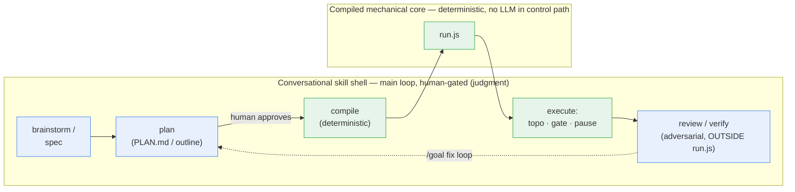

The **seam** is deliberate: every real bug in the ds/dev/writing/workshop ports was caught at a human
gate or by adversarial review — *not* by the mechanical gate. So the core stays small and honest, and
the judgment stays with humans and the review layer.

---

## 1. What it replaced — and why (the anti-pattern)

The first-generation workflows were **generic interpreters**: an in-workflow LLM "discovery" agent
re-parsed the plan into a DAG on *every* invocation, fanned out per level, then a heavyweight
re-analysis LLM verifier computed the gate.

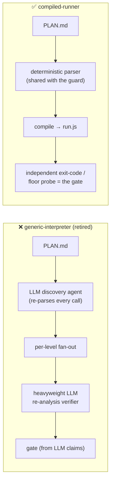

The discovery LLM wasn't just redundant — sitting **between a structured producer and a strict
checker**, it silently *tolerated* plan-format drift the guard rejects, masking spec-drift bugs while
looking like it worked (the ds "sleeper": `docs/investigations/2026-06-26_llm-discovery-masked-spec-drift.md`).
The re-analysis verifier "caught zero substantive bugs" in both ds and dev. Both were deleted.
This is **Iron Law: NO LLM between a structured producer and a strict checker** — wc-audit flags the
shape as `executionClass=generic-interpreter` → critical.

---

## 2. Birth of a runner — emitter / parser / guard / compiler

A new runner is born from **one format spec** shared across four pieces. There is no LLM anywhere in
this chain.

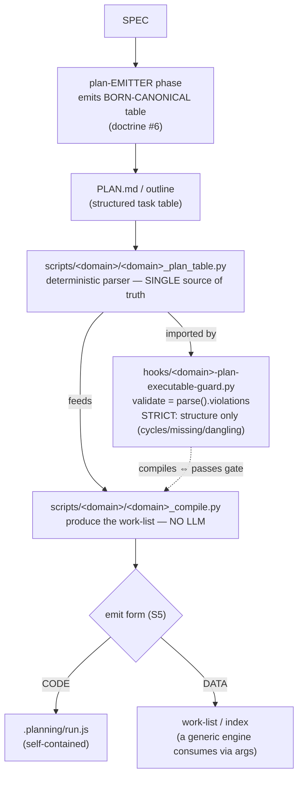

- **Emitter-canonical (doctrine #6):** the emitter writes the canonical format so plans are *born*
  canonical; the parser's tolerance is then a back-compat *shim*, not the primary defense. Two shapes:
  a machine producer *eliminates* tolerance (writing) → a strict guard; a hand-editable producer keeps
  *canonical emitter + intentional tolerance* (ds) → a structure-only tolerant guard. Golden-test the
  guard against a **REAL** pre-canonical artifact, never the template.
- **Single-source parser (S1/S6):** the guard `import`s the same parser the compiler uses, so
  "compiles ⇔ passes gate" is a property, not a hope. No second drifting regex.
- **Compile = produce the work-list (S5):** emit **CODE** (`run.js`) for a per-project DAG runner
  (ds/dev), or **DATA** (a work-list a generic fan-out engine consumes) when the engine already exists
  (writing/workshop/teaching). Absence of a `run.js` is *not* a gap — it is the DATA emit form.

---

## 3. The splice — one shared driver, a per-domain fragment

Post pass-#9, the **driver lives once** in `run-core.js`. The compiler **splices** it with a small
per-domain fragment into a self-contained `run.js`. Why splice and not `import`? A `Workflow` script
has **no filesystem or `import` at runtime** and `run.js` lives in an external project dir with no path
back to the plugin — so the shared core is inlined at compile time.

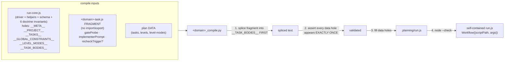

**Splice contract** (enforced in `<domain>_compile.py`, copied from `ds_compile.py`):
1. The fragment is a **fragment, not a module** — no `import`/`export`, function declarations only;
   it runs in run-core's lexical scope and *sees* `PROJECT`, `TASKS`, `DECISIONS`,
   `GLOBAL_CONSTRAINTS`, `agent`, `log`, `parallel`, `phase`, and the shared `TRANSFORM_SCHEMA`.
2. Splice the fragment into `__TASK_BODIES__` **first**, so the exactly-once hole assertion runs over
   the spliced text (it catches a hole token leaking out of the fragment or a comment).
3. `__LEVEL_MODES__` is **compiler-DERIVED** (see §4) — never an author knob.
4. `node --check` the emitted `run.js` (a splice has more failure modes than a single-file fill).

The birther scaffolds **only** the fragment (`compiled-runner-template.js` is the generic skeleton)
and the compiler — never a copy of the driver. wc-audit P22 deducts a hand-copied parallel driver as
drift-risk.

---

## 4. The run-core driver loop

`run-core.js` is one topo-sorted loop. Each level runs `parallel` or `sequential` per the
**compiler-derived** `LEVEL_MODES[li]`, gates each task on an **independent** probe, and yields to the
skill on one of four return-reasons.

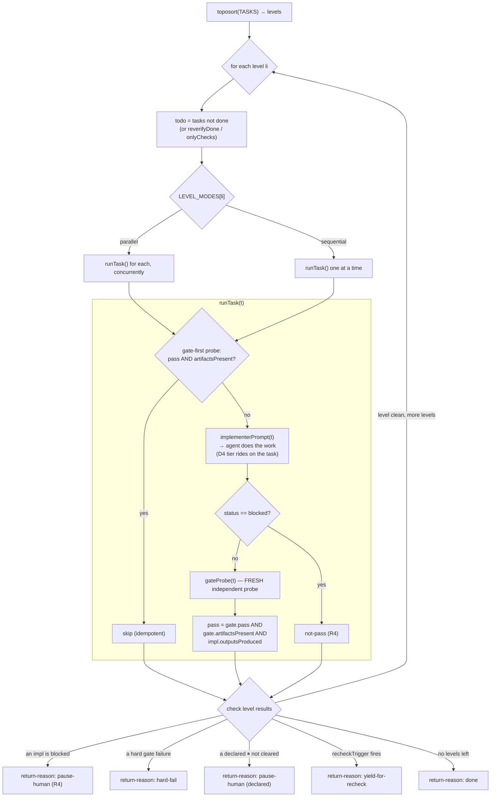

Key invariants visible in the loop:
- **Gate-first idempotent skip** — a task whose gate already passes *and* whose artifact exists is
  skipped (resume/recompile is cheap). A stale/clobbered artifact does **not** count as done.
- **The gate is a FRESH, independent probe** after implementation — never the implementer's
  self-report.
- **`pass ⊥ artifactsPresent`** — two independent booleans; the **core** ANDs them. A domain must not
  fold presence into pass (that re-opens the funnel-clobber blind spot).

### Intra-level parallel vs sequential is *derived*, not chosen

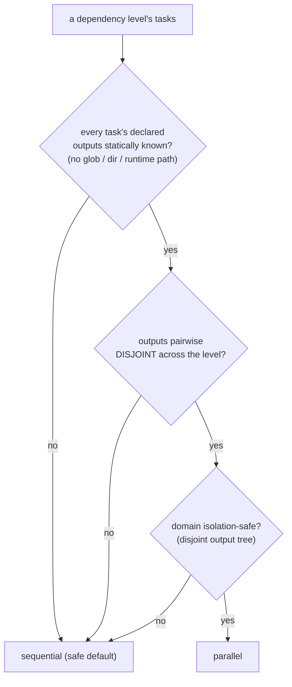

ds's disjoint parquet outputs qualify → parallel; dev's shared source tree never does → sequential **by
construction, not convention**. This is computed in `<domain>_compile.py::_level_modes` and killed the
earlier "D5 intra-level executor" seam proposal — a naive hand-set parallel copy corrupts a shared tree.

---

## 5. The gate — `gateProbe` and the trust-class fork

Every task is gated by `gateProbe(t)`, the **D1** injected interface, returning the canonical contract.

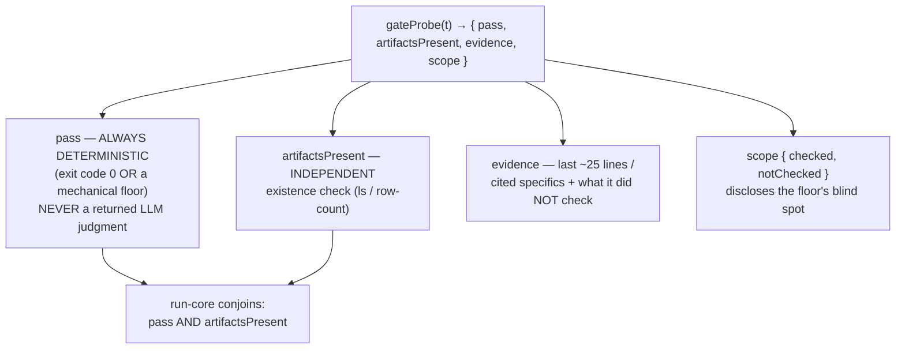

`pass` is **always deterministic**, so there is *nothing inside the runner to game* (no "haiku judging
prose"). The fork is **sufficiency**, not whether an LLM is involved:

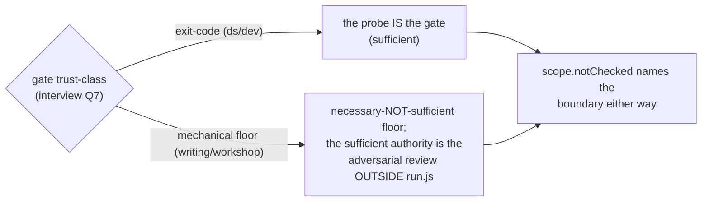

A clean `pass:true` must never over-claim coverage it lacks — the floor *discloses its blind spot* via
`scope` (doctrine #3). And a deterministic candidate-narrowing list that feeds the outside authority is
an **assist** (lives in `evidence`/`scope.notChecked`, judged per-item) — *not* a gate-bearing floor;
failing the gate on assist candidates is the inverted-G2 false-negative defect.

---

## 6. Return-reasons — how `run.js` hands control back

`run.js` never declares the whole job done on its own judgment. It **yields** to the skill with one of
four return-reasons; the skill loop branches on it and re-invokes with resume args.

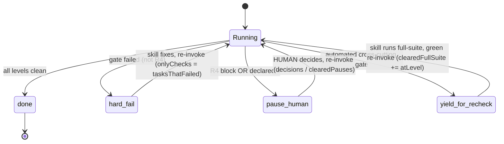

The two human-pause kinds and the automated recheck are **separate channels** — never muxed:

| return-reason | who acts | how the skill resumes |
|---------------|----------|------------------------|
| `done` | — | finished |
| `hard-fail` | skill (auto) | fix, re-invoke with `onlyChecks: tasksThatFailed` |
| `pause-human` (R4 / declared) | **a human** | bake the decision into the plan (gate-changing) + recompile, **or** pass `decisions[taskId]` (behavior-only) + `clearedPauses` |
| `yield-for-recheck` | skill (auto, no human) | run the cross-cutting gate (dev full-suite / ds coverage); on green re-invoke with `clearedFullSuite += atLevel` |

**Why this matters:** an automated recheck ("the skill must re-run the suite") is *not* a human
decision ("a human must choose"). Conflating them autopilots past exactly the decisions where real bugs
were caught.

---

## 7. Pause / resume — deterministic by construction

`run.js` is a *pure function* of `(TASKS, args, on-disk state)`. State that must survive a pause rides
in `args` (the script has no disk). A `pause-human` surfaces the implementer's **deviations + numbered
summary** — never a bare exit code (doctrine #1: payload > pass/fail).

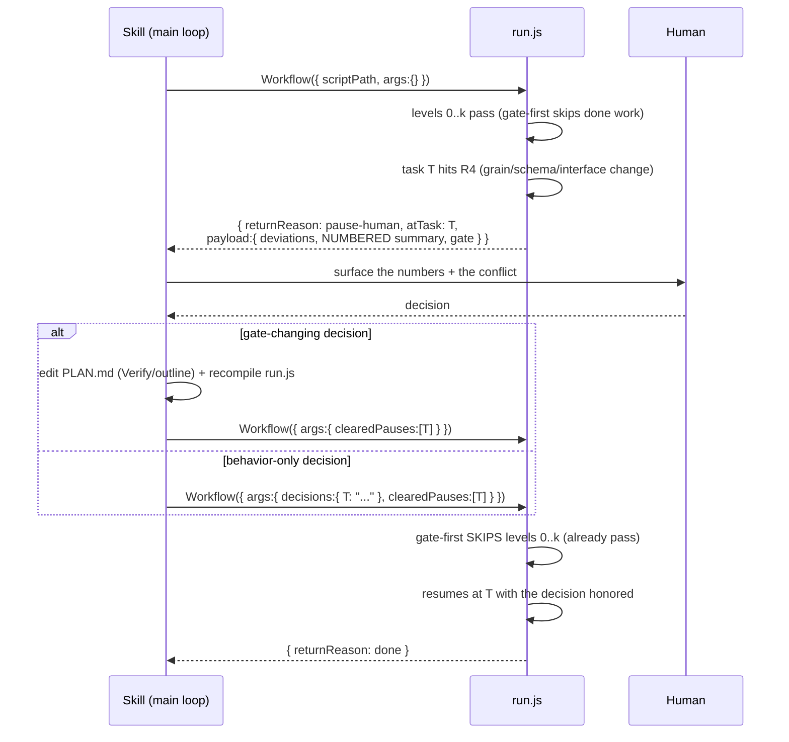

The **stale-gate backstop** (doctrine #2) closes the loop: if a decision changes the contract but the
plan's gate still encodes the old one, the implementer honors the decision in the work, then *re-blocks*
rather than reshaping the output to satisfy the stale gate. The decision routing is **layer-agnostic** —
it edits the stale upstream artifact at its layer (a data `Verify` command, or a spec `OUTLINE`/
`*_REVIEWED` sentinel) and recompiles.

---

## 8. Two compile-output variants — CODE and DATA

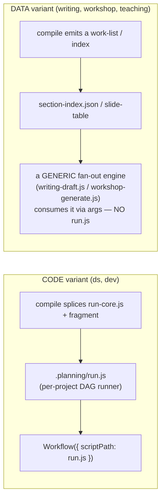

Both are `executionClass=compiled-runner` and score P22–P30 uniformly. The defining property is **a
deterministic compile/parser replaced the LLM discovery and the guard shares it** — *not* whether a
`run.js` file exists.

---

## 9. The audit view — `executionClass` and P22–P30

wc-audit's runner-architecture reviewer classifies a workflow's execution shape, then scores the
compiled-runner principles only when they apply.

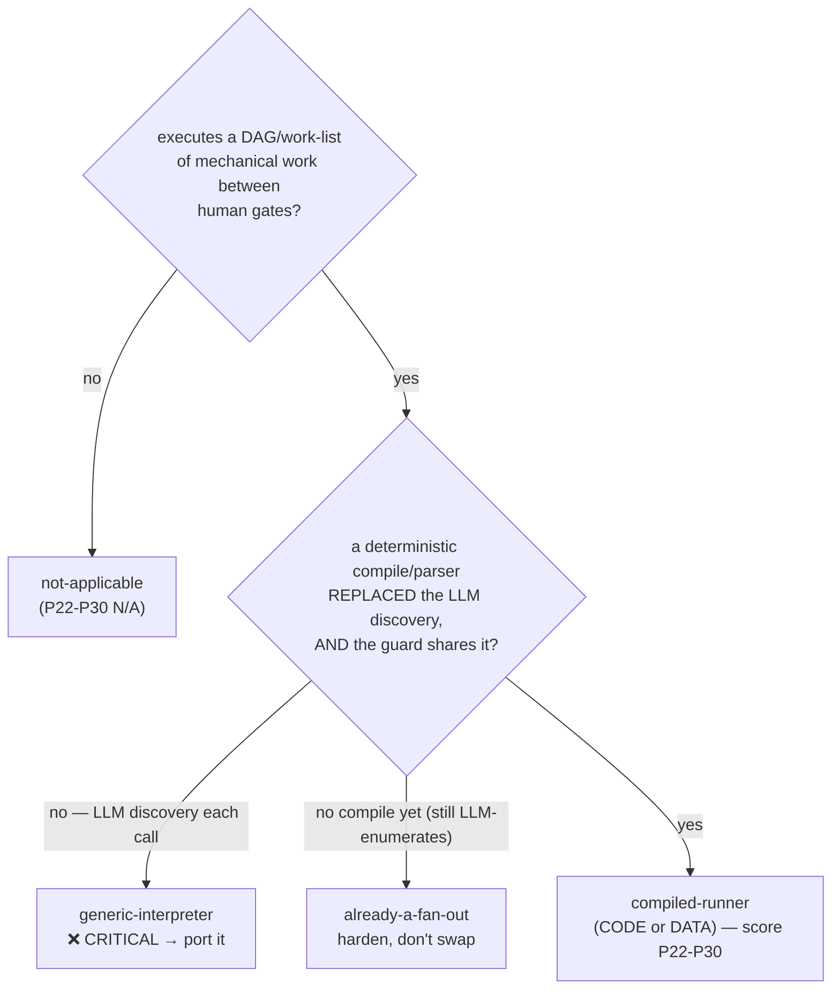

| Principle | What it asserts | Canonical seam |
|-----------|-----------------|----------------|
| P22 | deterministic compile (CODE splices run-core.js / DATA index), not LLM re-discovery | S2 + S5 · #5 |
| P23 | guard imports the single shared parser | S1 + S6 |
| P24 | honest gate: deterministic `pass` ⊥ `artifactsPresent` (core ANDs), `scope` discloses blind spot, assist≠floor | D1 + S4-art · #3/#4 |
| P25 | pause/resume + payload>pass-fail + stale-gate backstop + return-reason (no mux) | S3 + S4 · #1/#2 |
| P26 | adversarial layer OUTSIDE run.js (PRIMARY for a judgment gate) | #4 |
| P27 | join trust-class: multi-source enumeration ⇒ semantic join outside the parser | S5 |
| P28 | emitter-canonical hardened (two shapes; golden-test vs a REAL artifact) | #6 |
| P29 | guard passes the REAL shipped artifacts (phantom-canonical) | #6 |
| P30 | the gate covers every declared output | workshop "gate only what you compile" |

---

## 10. The six doctrine invariants (baked into `run-core.js`, never re-typed)

1. **payload > pass/fail** — pauses carry `deviations` + a numbered `summary`; the catch-channel.
2. **mandatory R4** — grain/schema/interface/architecture changes BLOCK + pause; a stale-gate backstop
   re-blocks rather than reshaping output to pass.
3. **probe corroborates the artifact** independently of `pass` (core ANDs the two booleans); the floor
   discloses its blind spot via `scope`.
4. **adversarial review stays OUTSIDE `run.js`** — and is the PRIMARY arbiter for a judgment gate.
5. **no LLM between a structured producer and a strict checker** — parse deterministically.
6. **emitter-canonical** — one format spec across emitter/parser/guard; born-canonical so the guard can
   go strict; the parser's tolerance is a back-compat shim.

---

## Where to look in the code

| Concept | File |
|---------|------|
| The shared driver (the loop, helpers, schema, invariants) | `workflows/templates/run-core.js` |
| Per-domain fragments (D1/D2 + optional recheck) | `workflows/templates/{ds,dev}-task.js` |
| The generic fragment skeleton (birther) | `workflows/templates/compiled-runner-template.js` |
| The splice compilers | `scripts/{ds,dev}/{ds,dev}_compile.py` |
| The shared parsers (single source of truth) | `scripts/{ds,dev}/{ds,dev}_plan_table.py` |
| The strict guards (import the parser) | `hooks/{ds,dev}-plan-executable-guard.py` |
| The seam list (what/why) | `docs/common-infra-candidates.md` |
| Per-domain designs | `docs/DESIGN-{ds,dev,writing,workshop}-spec-plan-compile.md` |
| The extraction design (pass #9) | `docs/DESIGN-run-core-extraction.md` |
| Birthing/auditing new runners | `skills/workflow-creator/` (Mode 1 Step 3 + references/dynamic-workflow-migration.md §0/§A; wc-audit P22-P30) |
