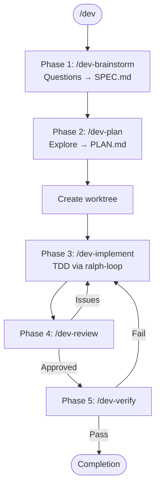

# Development Workflow

Structured workflow for features and non-trivial bug fixes using Task agents and modular skills.

<EXTREMELY-IMPORTANT>
## The Iron Law of Feature Development

**You MUST use the sub-skills. This is not negotiable.**

When implementing: invoke `/dev-implement` (enforces TDD)
When debugging: invoke `/dev-debug` (enforces root cause investigation)
When reviewing: invoke `/dev-review` (enforces quality checks)
When verifying: invoke `/dev-verify` (enforces fresh evidence)

This applies even when:
- "I can just implement this directly"
- "The feature is simple"
- "I already know what to do"
- "Using the skill seems like overkill"

**If you catch yourself about to write code without using the appropriate skill, STOP.**
</EXTREMELY-IMPORTANT>

## Red Flags - STOP Immediately If You Think:

| Thought | Why It's Wrong | Do Instead |
|---------|----------------|------------|
| "I'll just implement this quickly" | Skipping TDD leads to bugs | Use `/dev-implement` |
| "I know the fix already" | Skipping investigation leads to wrong fixes | Use `/dev-debug` |
| "Code looks fine to me" | Self-review misses issues | Use `/dev-review` |
| "It should work" | "Should" isn't verification | Use `/dev-verify` |
| "This is too simple for the workflow" | Simple things break too | Follow the workflow |
| "This doc should be versioned" | User decides what gets versioned | Write to `.claude/`, user copies to `docs/` |
| "I'll put specs in docs/plans/" | Specs go in `.claude/SPEC.md` | Use the correct location |

## Workflow



**Phase responsibilities:**
| Phase | Skill | Does | Outputs |
|-------|-------|------|---------|
| 1 | `/dev-brainstorm` | Questions, requirements | `.claude/SPEC.md` |
| 2 | `/dev-plan` | Explore codebase, tasks | `.claude/PLAN.md` |
| 3 | `/dev-implement` | TDD implementation | Working code + tests |
| 4 | `/dev-review` | Code review | Approval or issues |
| 5 | `/dev-verify` | Runtime verification | Fresh evidence |

**THIS SEQUENCE IS MANDATORY.** Do not skip any phase.

## How to Invoke Sub-Skills

**CRITICAL:** You MUST open the skill gate before invoking sub-skills.

```bash
# Step 1: Open the gate (REQUIRED before any dev-* skill)
mkdir -p .claude && touch .claude/skill-gate.lock

# Step 2: Invoke the skill
Skill(skill="dev-implement")

# The hook automatically closes the gate after skill starts
```

**Why:** Task agents run in isolated context and DON'T inherit skill instructions.
The Skill tool loads the protocol into main chat so you can pass it to Task agents.

## Core Rules

1. **Main chat orchestrates, Task agents execute** - Never write code directly
2. **Sequential implementation** - Task agents run one at a time
3. **Single-pass review** - `/dev-review` combines spec and quality checks
4. **Verify before claiming** - Run commands, see output, then claim success
5. **Document findings** - LEARNINGS.md for attempts, SPEC.md for requirements
6. **Use Ralph for iteration** - Main chat starts ralph-loop, spawns Task agents inside loop

## CRITICAL: Bug Fix Protocol

**When user reports a bug, main chat MUST NOT fix it directly.**

Even if you know exactly what the fix is. Even if it's one line. Even after investigating.

### Mandatory Bug Response Pattern

```
User: "bug: [description]"

Main chat response:
"Using `/dev-debug` workflow."

Then IMMEDIATELY:
1. Open skill gate
2. Invoke /dev-debug
```

## Project Structure

All Claude docs go in `.claude/` folder (add to `.gitignore`):

```
project/
├── .claude/                       # gitignored
│   ├── SPEC.md                    # requirements (from brainstorm)
│   ├── PLAN.md                    # task breakdown (from plan)
│   ├── LEARNINGS.md               # chronological attempt log
│   └── skill-gate.lock            # transient gate marker
└── ...
```

## Related Skills

- `/dev-brainstorm` - Interactive design refinement
- `/dev-plan` - Codebase exploration and task breakdown
- `/dev-implement` - TDD implementation
- `/dev-review` - Single-pass code review
- `/dev-debug` - Systematic debugging methodology
- `/dev-verify` - Verification gate
