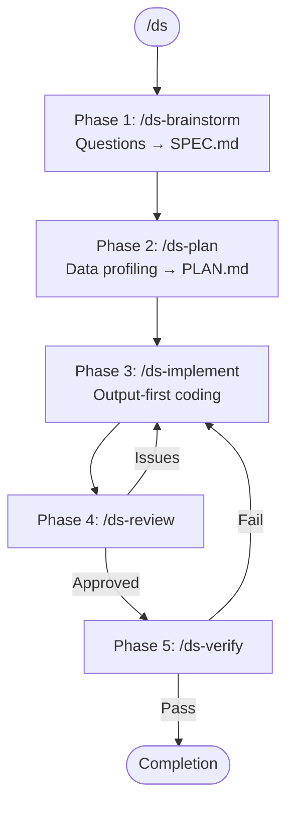

# Data Science Workflow

Structured workflow for data analysis and modeling using Task agents and modular skills.

<EXTREMELY-IMPORTANT>
## The Iron Law of Data Science

**You MUST use the sub-skills. This is not negotiable.**

When planning analysis: invoke `/ds-brainstorm` (clarifies objectives)
When exploring data: invoke `/ds-plan` (profiles data first)
When implementing: invoke `/ds-implement` (output-first verification)
When reviewing: invoke `/ds-review` (methodology checks)
When verifying: invoke `/ds-verify` (reproducibility checks)

This applies even when:
- "I can just run this analysis directly"
- "The data is simple"
- "I already know what to do"
- "Using the skill seems like overkill"

**If you catch yourself about to write analysis code without using the appropriate skill, STOP.**
</EXTREMELY-IMPORTANT>

## Red Flags - STOP Immediately If You Think:

| Thought | Why It's Wrong | Do Instead |
|---------|----------------|------------|
| "I'll just run this query" | Skipping profiling leads to bad data | Use `/ds-plan` |
| "I know the analysis already" | Skipping exploration leads to wrong conclusions | Use `/ds-brainstorm` |
| "Results look fine to me" | Self-review misses methodology issues | Use `/ds-review` |
| "It should be reproducible" | "Should" isn't verification | Use `/ds-verify` |
| "This is too simple for the workflow" | Simple analyses can still be wrong | Follow the workflow |

## Workflow



**Phase responsibilities:**
| Phase | Skill | Does | Outputs |
|-------|-------|------|---------|
| 1 | `/ds-brainstorm` | Questions, objectives | `.claude/SPEC.md` |
| 2 | `/ds-plan` | Data profiling, exploration | `.claude/PLAN.md` |
| 3 | `/ds-implement` | Output-first implementation | Working code + results |
| 4 | `/ds-review` | Methodology review | Approval or issues |
| 5 | `/ds-verify` | Reproducibility verification | Fresh evidence |

**THIS SEQUENCE IS MANDATORY.** Do not skip any phase.

## How to Invoke Sub-Skills

**CRITICAL:** You MUST open the skill gate before invoking sub-skills.

```bash
# Step 1: Open the gate (REQUIRED before any ds-* skill)
mkdir -p .claude && touch .claude/skill-gate.lock

# Step 2: Invoke the skill
Skill(skill="ds-implement")

# The hook automatically closes the gate after skill starts
```

**Why:** Task agents run in isolated context and DON'T inherit skill instructions.
The Skill tool loads the protocol into main chat so you can pass it to Task agents.

## Core Principles

1. **Output-first verification** - Every code step must produce visible output
2. **Main chat orchestrates, Task agents execute** - Never write analysis directly
3. **Data profiling before analysis** - Know your data before analyzing
4. **Verify reproducibility** - Seeds, versions, environment must be documented
5. **Document findings** - LEARNINGS.md for attempts, SPEC.md for objectives

## Key Differences from /dev Workflow

| /dev | /ds |
|------|-----|
| TDD (test-first) | Output-first verification |
| Uses ralph-loop | Direct Task agent spawning |
| Tests verify correctness | Output quality verification |
| Code review focus | Methodology review focus |

## Project Structure

All Claude docs go in `.claude/` folder (add to `.gitignore`):

```
project/
├── .claude/                       # gitignored
│   ├── SPEC.md                    # analysis objectives (from brainstorm)
│   ├── PLAN.md                    # data profile + task breakdown (from plan)
│   ├── LEARNINGS.md               # chronological attempt log
│   └── skill-gate.lock            # transient gate marker
└── ...
```

## Related Skills

- `/ds-brainstorm` - Clarify analysis objectives
- `/ds-plan` - Data profiling and exploration
- `/ds-implement` - Output-first implementation
- `/ds-review` - Methodology and quality review
- `/ds-verify` - Reproducibility verification
