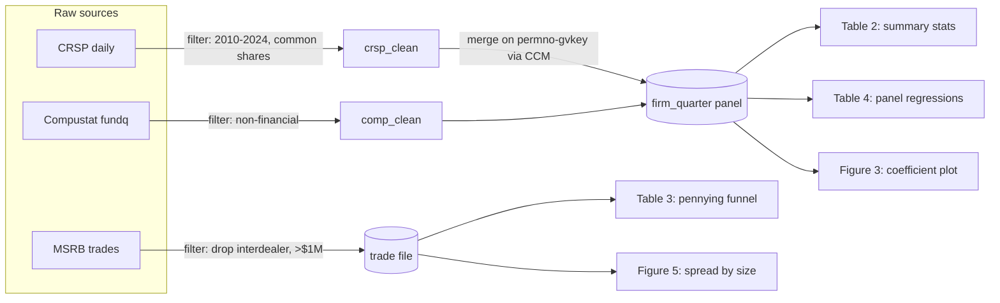

## Rule

For most projects, the analysis is built on the **smallest set of canonical "master" datasets** from which ALL tables and figures are derived — one consistent methodology feeding every exhibit, NOT an ad-hoc per-exhibit data pull. A "master dataset" is an analysis-ready table (typically the cleaned, merged, filtered panel/cross-section/event file) that downstream exhibit code reads directly.

The plan MUST do three things:

1. **Name the master datasets** — the minimal set (often 1–3) every exhibit draws from.
2. **Define each one's grain and keys** — one row = one *what* (firm-quarter, trade, security-day, meeting-vote), and the column-set that is unique at that grain.
3. **Map every planned table/figure to the master dataset(s) it reads** — an exhibit→dataset table with no exhibit unmapped and no exhibit pulling raw sources directly.

This makes the methodology consistent by construction: sample filters, winsorization, key definitions, and merges happen ONCE in the master-dataset build, so every exhibit inherits the same sample and the same numbers. Ad-hoc per-exhibit pulls produce exhibits that silently disagree (different row counts, different filters, different vintages) — the failure this rule exists to prevent.

**When a single master dataset is wrong:** distinct grains genuinely require distinct masters (e.g., a firm-quarter panel for regressions AND a trade-level file for microstructure). Minimal ≠ exactly one — it means *no more masters than distinct analysis grains require*, each justified. Splitting one grain across several ad-hoc files is the anti-pattern; merging two genuinely different grains into one bloated file is the opposite anti-pattern. (Reference: the muni-pennying project landed on exactly two masters — `trades`, grain one MSRB print, key cusip × event_ts; and `auctions`, grain one executed bid-wanted auction, key cusip × link_identifier — because the unit of analysis genuinely differs, and every exhibit is a filter/aggregate of one of them.)

### Master design notes (from the muni-pennying reference)

- **Carry multiple benchmarks/variants as COLUMNS, not as forked datasets.** When a result can be computed against more than one benchmark (e.g. an inter-dealer mid AND a quoted BBO; or a 3-, 5-, and 10-day window), put them all on the master as columns (`cost_vs_mid`, `quote_cost_bps`, `mid_lag_days`, `MID_WINDOWS=(3,5,10)`) with flag columns for availability (`has_same_day_mid`, `two_sided`). Forking `trades_vs_mid` and `trades_vs_quote` into separate masters re-introduces the divergence this rule exists to prevent — the two would drift in sample.
- **The funnel reports TWO counts per step: N rows AND N distinct keys** (e.g. N trades and N distinct CUSIPs). Reviewers tie out on both — a step that drops rows but no CUSIPs means something different from one that drops whole securities. The construction funnel IS [[sample-selection]] applied to the master; report both counts at each filter edge.
- **"Recover, don't drop" — then VALIDATE against ground truth.** Before discarding rows that fail a status/quality field, check whether the sample can be *recovered* by a defined rule, and validate that rule against clean-labeled rows (recall / false-positive) before adopting it. muni recovered the auction sample ~6× this way: the status field was BLANK/PENDING for 91% of rows, so "executed" was redefined by a match rule and validated at 86% recall / 21% FP against the labeled minority. Flag the recovered selection with a dummy and report sensitivity. Dropping the 91% would have been a silent, catastrophic selection — recovery + validation is a master-construction decision, recorded in the construction diagram's filter edges.

## Dataset-Construction Mermaid Diagram (required doc deliverable)

Documentation MUST include a mermaid `flowchart` of dataset construction: **raw sources → merges → filters → master datasets → exhibits**, with the merging and filtering steps explicit (named join keys, named filters with the row count they drop). This is the visual companion to the [[sample-selection]] funnel and the [[table-figure-pairing]] exhibit set — it shows, at a glance, that every exhibit traces back through one consistent construction path to the raw sources.

The diagram is specified in PLAN.md (the construction the plan intends) and produced/kept current in the analysis docs as the pipeline is built (the construction that actually ran). If the built pipeline diverges from the planned diagram, the diagram is updated and the divergence noted — a stale diagram that contradicts the code is worse than none, because the reader trusts it.



Master datasets are the `[(rounded)]` nodes; raw sources and intermediates are plain nodes; exhibits are leaf nodes named by their table/figure number. Every edge into a master carries its merge key or filter. Every exhibit node has exactly one incoming path from a master — if an exhibit reads a raw source directly, that is the rule violation the diagram makes visible.

Layout (`TD` or `LR`) and master-node shape (`[(rounded)]` or `[[subroutine]]`) are conventions — pick one and be consistent (the muni-pennying reference uses `flowchart TD` with `[[master]]`). What matters is that **merge edges carry their keys** and **filter edges carry their named filter AND its row-drop** (e.g. `price_ok`, `exec_confirmed`, `winsorize`) — ideally both counts, rows and distinct keys, per the funnel rule above.

## Exhibit → Dataset Map (PLAN.md section)

```markdown
## Master Datasets

| Master | Grain (one row =) | Keys (unique at grain) | Built by Task | Source intermediates |
|--------|-------------------|------------------------|---------------|----------------------|
| firm_quarter.parquet | one firm-quarter | (gvkey, yearq) | Task 4 | crsp_clean, comp_clean |
| trade_file.parquet | one muni trade | (cusip, trade_dt, seqnum) | Task 5 | msrb_clean |

## Exhibit → Dataset Map

| Exhibit | Reads master | Notes |
|---------|--------------|-------|
| Table 2 (summary stats) | firm_quarter | — |
| Table 3 (pennying funnel) | trade_file | funnel = sample-selection on trade_file |
| Table 4 (panel regressions) | firm_quarter | — |
| Figure 3 (coef plot) | firm_quarter | companion to Table 4 |
| Figure 5 (spread by size) | trade_file | companion to Table 3 |
```

Every exhibit in the SPEC's planned-exhibits list appears in this map; every master in the map appears as a `[(node)]` in the mermaid diagram and is built by a real task in the Task Breakdown.

## Facts

- Exhibits built from independent per-exhibit pulls disagree silently: Table 2's N is 48,310 and Table 4's is 47,902 because each re-applied the sample filter slightly differently. The reader cannot tell which is right, and "the tables don't tie out" surfaces at referee/reviewer time — days after the analysis felt done. A single master dataset makes one sample, so every exhibit ties out by construction; skipping it to "just pull what each table needs" is the shortcut that manufactures the inconsistency.
- The master grain is a decision, not a discovery: the same raw data supports a firm-quarter panel and a trade-level file, and which one is "master" depends on the exhibit set, not on the data. Declaring the grain and its unique key in the plan is what lets the implementer build the file once; leaving it implicit means each exhibit's author re-guesses the grain and the keyed dedup, which is how join fan-out (see [[ds-join-audits]]) reaches the final numbers.
- A mermaid diagram that omits the filter/merge edges is decoration, not a spec — the whole point is that the dropped-row counts and join keys are visible on the edges, so a reader can audit the sample funnel without reading the code. An edgeless "sources → master → tables" box diagram hides exactly the steps that go wrong.
- The diagram is cheap to keep current and expensive to reconstruct later: it is written once from the plan and edited as tasks land. A diagram drawn from memory at write-up time, after the pipeline changed three times, will quietly contradict the code — and a confident-looking diagram that lies is worse than no diagram, because the reader trusts the picture over the script.
- "This project is too small/exploratory for master datasets" is sometimes true — a one-off descriptive pull feeding one table does not need the apparatus. But the moment there are 3+ exhibits that must share a sample, ad-hoc pulls are not faster, they are deferred reconciliation: the time saved skipping the master build is repaid with interest when the exhibits have to be forced to agree.
