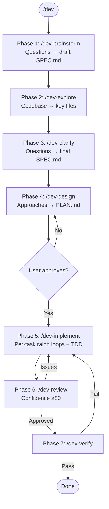

## Activation

First, activate the dev workflow and sandbox:

```bash
mkdir -p /tmp/claude-workflow-$PPID && touch /tmp/claude-workflow-$PPID/dev_mode && echo "✓ Dev workflow activated"
```

**REQUIRED NEXT STEP:** After activation, IMMEDIATELY invoke:
```
Skill(skill="workflows:dev-brainstorm")
```

Do NOT ask "What would you like to implement?" - the brainstorm phase handles requirements gathering.

---

## Reference: Workflow Overview

## Contents

- [The Iron Law of Feature Development](#the-iron-law-of-feature-development)
- [Red Flags - STOP Immediately If You Think](#red-flags---stop-immediately-if-you-think)
- [Workflow](#workflow)
- [Core Rules](#core-rules)
- [CRITICAL: Bug Fix Protocol](#critical-bug-fix-protocol)
- [Project Structure](#project-structure)
- [Related Skills](#related-skills)

# Development Workflow

Structured 7-phase workflow for features and non-trivial bug fixes using Task agents and modular skills.

<EXTREMELY-IMPORTANT>
## The Iron Law of Feature Development

**You MUST use the sub-skills. This is not negotiable.**

Each phase has a dedicated skill:
- `/dev-brainstorm` - Initial questions
- `/dev-explore` - Codebase exploration
- `/dev-clarify` - Post-exploration questions
- `/dev-design` - Architecture with **user approval gate**
- `/dev-implement` - TDD implementation
- `/dev-review` - Confidence-scored review
- `/dev-verify` - Runtime verification

This applies even when:
- "I can just implement this directly"
- "The feature is simple"
- "I already know what to do"

**If you catch yourself about to skip a phase, STOP.**
</EXTREMELY-IMPORTANT>

## Red Flags - STOP Immediately If You Think:

| Thought | Why It's Wrong | Do Instead |
|---------|----------------|------------|
| "I'll just implement this quickly" | Skipping phases leads to bugs | Follow all 7 phases |
| "I know the architecture" | Must explore first | Use `/dev-explore` |
| "User will approve anything" | Approval is a gate | Ask explicitly in `/dev-design` |
| "Code looks fine to me" | Self-review misses issues | Use `/dev-review` |
| "It should work" | "Should" isn't verification | Use `/dev-verify` |

## Workflow



**Phase responsibilities:**

| Phase | Skill | Does | Outputs |
|-------|-------|------|---------|
| 1 | `/dev-brainstorm` | Initial questions | Draft `.claude/SPEC.md` |
| 2 | `/dev-explore` | Explore codebase, spawn agents | Key files list (10-15) |
| 3 | `/dev-clarify` | Questions based on exploration | Final `.claude/SPEC.md` |
| 4 | `/dev-design` | 2-3 approaches, **user picks** | `.claude/PLAN.md` |
| 5 | `/dev-implement` | Per-task ralph loops + TDD | Working code + tests |
| 6 | `/dev-review` | Confidence-scored review | Approval or issues |
| 7 | `/dev-verify` | Runtime verification | Fresh evidence |

**THIS SEQUENCE IS MANDATORY.** Do not skip any phase.

## Core Rules

1. **Main chat orchestrates, Task agents execute** - Never write code directly
2. **Read key files after exploration** - Don't skip this step
3. **User approval before implementation** - Phase 4 has explicit gate
4. **Confidence scoring in review** - Only report issues ≥80%
5. **Verify before claiming** - Run commands, see output, then claim
6. **Document findings** - LEARNINGS.md for attempts, SPEC.md for requirements

## CRITICAL: Bug Fix Protocol

**When user reports a bug, main chat MUST NOT fix it directly.**

Even if you know exactly what the fix is. Even if it's one line.

### Mandatory Bug Response Pattern

```
User: "bug: [description]"

Main chat response:
"Using `/dev-debug` workflow."

Then IMMEDIATELY invoke /dev-debug.
```

## Project Structure

All Claude docs go in `.claude/` folder (add to `.gitignore`):

```
project/
├── .claude/                       # gitignored
│   ├── SPEC.md                    # requirements (phases 1, 3)
│   ├── PLAN.md                    # chosen approach (phase 4)
│   └── LEARNINGS.md               # attempt log (phase 5)
└── ...
```

Session markers are stored in `/tmp/claude-workflow-$PPID/` (auto-cleaned on exit).

## Related Skills

### Workflow Phases
- `/dev-brainstorm` - Initial questions and requirements
- `/dev-explore` - Codebase exploration with key files
- `/dev-clarify` - Post-exploration clarification
- `/dev-design` - Architecture approaches with user gate
- `/dev-implement` - Orchestrates implementation (main chat)
- `/dev-review` - Confidence-scored code review
- `/dev-verify` - Runtime verification gate
- `/dev-debug` - Systematic debugging methodology

### Implementation Sub-Skills
- `/dev-ralph-loop` - Per-task loop pattern (main chat)
- `/dev-delegate` - Task agent templates (main chat)
- `/dev-tdd` - TDD protocol (Task agents)
- `/dev-test` - Testing tools reference (Task agents)