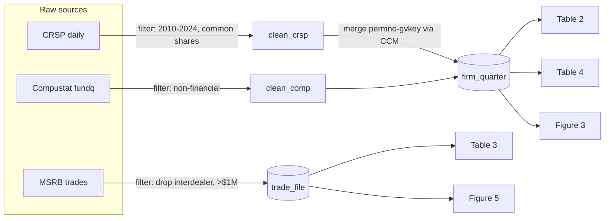

Announce: "Using ds-plan (Phase 2) to profile data and create task breakdown."

## Contents

- [The Iron Law of DS Planning](#the-iron-law-of-ds-planning)
- [What Plan Does](#what-plan-does)
- [Process](#process)
- [Red Flags - STOP If You're About To](#red-flags---stop-if-youre-about-to)
- [Output](#output)

## Context Monitoring

| Level | Remaining Context | Action |
|-------|------------------|--------|
| Normal | >35% | Proceed normally |
| Warning | 25-35% | Complete current profiling task, then trigger ds-handoff |
| Critical | ≤25% | Immediately trigger ds-handoff — do not start new profiling |

# Planning (Data Profiling + Task Breakdown)

Profile the data and create an analysis plan based on the spec.
**Requires `.planning/SPEC.md` from /ds first.**

**Load shared enforcement first.**

Auto-load all constraints matching `applies-to: ds-plan`:

!`uv run python3 ${CLAUDE_SKILL_DIR}/../../scripts/load-constraints.py ds-plan`

**You MUST have these constraints loaded before proceeding. No claiming you "remember" them.** The `ds-external-skill-discovery` constraint governs Step 5b (External Skill Discovery Gate); `ds-data-pull-profile` governs Step 5c (Data Pull Profiling Gate); `ds-master-datasets` governs Step 5d (Master Dataset Design); `ds-parameter-transparency` governs Step 5e (Parameter Inventory).

<EXTREMELY-IMPORTANT>
## The Iron Law of DS Planning

**SPEC MUST EXIST BEFORE PLANNING. This is not negotiable.**

Before exploring data or creating tasks, you MUST have:
1. `.planning/SPEC.md` with objectives and constraints
2. Clear success criteria
3. User-approved spec

**If `.planning/SPEC.md` doesn't exist, run /ds first.**
</EXTREMELY-IMPORTANT>

### Profiling Facts

- Real-world data is never clean on arrival, and `.head()` samples the clean front of the file — nulls, type drift, and grain problems live in the tail and in rare groups. A plan built from a head-sample is built on assumptions; it crashes 3 tasks into implementation and the user redoes hours of work. Delivering that plan fast is not helpful — it is counterproductive, and it reads as incompetent.
- Data-quality checking is your job whether or not the user mentions it. A plan that silently assumes clean data asserts a verification you never performed — an unverified claim presented as fact is a form of dishonesty.
- Profiling costs minutes; a wrong plan costs hours. Skipping it to save time triples the work — the shortcut is counterproductive on its own terms.
- Thin, vague tasks push the guessing onto the implementer, who executes the plan literally and guesses wrong. Speed achieved by under-specifying is not efficiency; it is deferred confusion delivered to someone else.

### No Pause After Completion

After writing `.planning/PLAN.md` and initializing `.planning/LEARNINGS.md`, IMMEDIATELY discover and load ds-implement:
Read `${CLAUDE_SKILL_DIR}/../../skills/ds-implement/SKILL.md` and follow its instructions.

DO NOT:
- Ask "should I proceed with implementation?"
- Summarize the plan
- Wait for user confirmation (they approved SPEC already)
- Write status updates

The workflow phases are SEQUENTIAL. Complete plan → immediately start implement.

## What Plan Does

| DO | DON'T |
|-------|----------|
| Read .planning/SPEC.md | Skip brainstorm phase |
| Profile data (shape, types, stats) | Skip to analysis |
| Identify data quality issues | Ignore missing/duplicate data |
| Create ordered task list | Write final analysis code |
| Write .planning/PLAN.md | Make completion claims |

**Brainstorm answers: WHAT and WHY**
**Plan answers: HOW and DATA QUALITY**

## Process

**This flowchart IS the specification. If prose elsewhere and this diagram disagree, the diagram wins.** The sub-gates (5b External Skill Discovery, 5c Data Pull Profiling, 5d Master Dataset Design, 5e Parameter Inventory) and the exit Plan Review are mandatory when their triggers fire — they are not optional steps a fast path can skip. Step 5d fires for any project with 3+ planned exhibits sharing a sample; Step 5e fires for any project with sample filters or tuning parameters (nearly all).

```
 1. Verify SPEC.md exists ──(missing)──▶ STOP, run /ds first
            │
            ▼
 2. Profile data ──(2+ sources)──▶ parallel read-only profiler per source
            │
            ▼
 3. Identify DQ issues (nulls, dups, row counts)
            │
            ▼
 4. ETL strategy ──(heavy ETL trigger)──▶ server-side / chunked plan
            │
            ▼
 5b. External Skill Discovery ──(SPEC names wrds/gemini-batch/etc.)──▶ Glob refs/examples, ADOPT/PATCH
            │
            ▼
 5c. Data Pull Profiling gate ──(source ≥50M rows / ≥500MB / "large")──▶ read-only size profile → decision table
            │
            ▼
 5d. Master Dataset Design ──▶ name minimal master datasets + grain/keys, map every exhibit→master, draft construction mermaid diagram
            │
            ▼
 5e. Parameter Inventory ──▶ list every filter/threshold/cap/window, centralize in one config location, mark principled(✓)-vs-convenience(⚠), assign each ⚠ a disposition (robustness panel / verified-redundant / display-only)
            │
            ▼
 6. Task breakdown (each task carries implements: [REQ-ID]; master-build tasks produce the master datasets)
            │
            ▼
 7. Write .planning/PLAN.md
            │
            ▼
 Exit gate ──▶ dispatch ds-plan-reviewer ──(ISSUES)──▶ fix PLAN.md, re-dispatch (max 5)
                                          └──(APPROVED)──▶ ds-implement
```

### 1. Verify Spec Exists

```bash
cat .planning/SPEC.md  # verify-spec: read SPEC file to confirm it exists
```

If missing, stop and run `/ds` first.

### 2. Data Profiling

**For multiple data sources:** Profile in parallel using background Task agents.

#### Single Data Source (Direct Profiling)

**MANDATORY profiling steps:**

```python
import pandas as pd

# Basic structure
df.shape                    # (rows, columns)
df.dtypes                   # Column types
df.head(10)                 # Sample data
df.tail(5)                  # End of data

# Summary statistics
df.describe()               # Numeric summaries
df.describe(include='object')  # Categorical summaries
df.info()                   # Memory, non-null counts

# Data quality checks
df.isnull().sum()           # Missing values per column
df.duplicated().sum()       # Exact-duplicate rows (byte-identical)
df[col].value_counts()      # Distribution of categories

# Grain / candidate-key identification (REQUIRED — do not skip)
# Profiling MUST output the row grain, not just a dup count. An all-columns
# df.duplicated() is unreliable in BOTH directions: it misses near-duplicates
# (amended/restated records that changed one field), AND it reports zero dupes
# after a join fan-out — fanned rows differ in the joined columns, so only a
# KEYED check (subset=grain) reveals them. Reporting "no duplicates" from the
# all-columns check is a false clean signal, not a verification.
# Identify the key empirically AND check it against the declared grain.
from itertools import combinations
cand = [c for c in df.columns if df[c].notna().any()]
for k in (1, 2, 3):                              # smallest unique column-set = de-facto PK
    hit = next((c for c in combinations(cand, k)
                if not df.duplicated(subset=list(c)).any()), None)
    if hit:
        print("candidate key:", hit); break
# Declared grain: look it up in the dataset's reference skill (e.g. wrds
# insider-form4.md → row PK (dcn, seqnum); event key (personid, trandate, ...)).
# Record BOTH the row PK and the coarser business/event key in PLAN.md.
df.duplicated(subset=DECLARED_PK).sum()          # MUST be 0, else extraction fanned out
df.groupby(BUSINESS_KEY).size().gt(1).sum()      # business-key collisions = restatement/amendment signal

# For time series
df[date_col].min(), df[date_col].max()  # Date range
df.groupby(date_col).size()              # Records per period
```

#### Multiple Data Sources (Parallel Profiling)

<EXTREMELY-IMPORTANT>
**Pattern from oh-my-opencode: Launch ALL profiling agents in a SINGLE message.**

**Use `run_in_background: true` for parallel execution.**

When profiling 2+ data sources, launch agents in parallel:
</EXTREMELY-IMPORTANT>

```
# PARALLEL + BACKGROUND: All Task calls in ONE message

Task(
    subagent_type="general-purpose",
    description="Profile dataset 1",
    run_in_background=true,
    # STRUCTURAL read-only enforcement — not advisory prose. Profiling is a
    # read-only verification step; Write/Edit/NotebookEdit are withheld at the
    # tool layer so a profiler CANNOT mutate pipeline files even if the prompt
    # is ignored (P17 — agent tool restrictions are structural, never prose).
    allowed_tools=["Read", "Glob", "Grep", "Bash"],
    prompt="""
Profile this dataset and return a data quality report.

Dataset: /path/to/dataset1.csv

Required checks:
1. Shape: rows x columns
2. Data types: df.dtypes
3. Missing values: df.isnull().sum()
4. Exact-duplicate rows: df.duplicated().sum() — lower bound only; the keyed checks in 5-6 are authoritative (all-columns dedup reports zero on join fan-out)
5. GRAIN / candidate key: find the smallest column-set that is unique (the de-facto
   primary key). If this dataset comes from a known source (WRDS, etc.), look up its
   DECLARED grain in that source's reference skill and verify df.duplicated(subset=PK)==0.
6. Business/event-key collisions: pick the coarser real-world key and report rows that
   share it but are NOT byte-identical — these are restatements/amendments/corrections
   that df.duplicated() misses (e.g. Form 4 4/A re-filings).
7. Summary statistics: df.describe()
8. Unique value counts for categorical columns
9. Date range if time series
10. Memory usage: df.info()

Output format:
- Markdown table with column summary
- The row primary key and the business/event key you identified
- List of data quality issues found (call out any key-uniqueness or amendment/restatement findings)
- Recommendations for cleaning

Read-only profiling: you have Read/Glob/Grep/Bash only (enforced via allowed_tools).
""")

Task(
    subagent_type="general-purpose",
    description="Profile dataset 2",
    run_in_background=true,
    prompt="""
[Same template for dataset 2]
""")

Task(
    subagent_type="general-purpose",
    description="Profile dataset 3",
    run_in_background=true,
    prompt="""
[Same template for dataset 3]
""")
```

**After launching agents:**
- Continue to other work (don't wait) — you'll be notified when each completes
- For agents running long ETL/profiling scripts, use Monitor to stream progress:

```
# If a profiling agent runs a heavy script, monitor its progress
Monitor(
  description="Profile large dataset progress",
  timeout_ms=600000, persistent=false,
  command="tail -f /tmp/profile_dataset1.log 2>/dev/null | grep --line-buffered -E '(rows|shape|complete|error)'"
)
```

**Note:** Background agents already notify on completion. Use Monitor only when you need streaming progress from a specific long-running script within the agent's work.

**Benefits:**
- 3x faster profiling for 3 datasets
- Each agent focused on single source
- Results consolidated in main chat

### 3. Identify Data Quality Issues

**CRITICAL:** Document ALL issues before proceeding:

| Check | What to Look For |
|-------|------------------|
| Missing values | Null counts, patterns of missingness |
| Duplicates | Exact duplicates, key-based duplicates |
| Outliers | Extreme values, impossible values |
| Type issues | Strings in numeric columns, date parsing |
| Cardinality | Unexpected unique values |
| Distribution | Skewness, unexpected patterns |

### 4. ETL Strategy Assessment (Conditional)

**Triggers when profiling reveals ANY of:**
- Total rows > 1M across all sources
- Multiple data sources requiring joins/merges
- Data sourced from remote databases (WRDS, SQL servers, APIs)

**If triggered, assess these dimensions before creating the task breakdown.**
**If WRDS data is involved**, also load the PostgreSQL vs SAS decision guide: Read `${CLAUDE_SKILL_DIR}/../../skills/wrds/references/postgres-vs-sas.md` — use the decision flowchart to assign each ETL task to the right engine.

#### A. Filter Push-Down Strategy

**The anti-pattern:** Pull entire tables into memory, then filter in pandas/R/SAS.

```
AskUserQuestion(questions=[{
  "question": "Where should filtering happen for this data?",
  "header": "Filtering",
  "options": [
    {"label": "Database-level (Recommended)", "description": "SQL WHERE clauses filter at source. Only matching rows transfer. Required for >1M row tables."},
    {"label": "Application-level", "description": "Pull full dataset, filter in code. Only acceptable for small tables (<100K rows) or when database access is read-once."},
    {"label": "Hybrid", "description": "Coarse filter at database (date range, key columns), fine filter in code (complex logic, cross-table conditions)."}
  ],
  "multiSelect": false
}])
```

**Document in PLAN.md:** For each data source, specify WHERE the filtering happens and WHY.

#### B. Parallelism Assessment

**The anti-pattern:** Process years/groups sequentially when they're embarrassingly parallel.

Identify parallelizable dimensions from profiling:
- **Time:** year-by-year, month-by-month processing
- **Groups:** firm-by-firm, sector-by-sector processing
- **Sources:** independent data sources profiled/cleaned in parallel

```
AskUserQuestion(questions=[{
  "question": "How should parallelizable tasks be executed?",
  "header": "Parallelism",
  "options": [
    {"label": "Background Task agents (Recommended)", "description": "Spawn parallel Task agents for independent groups/years. Best for in-session work with Claude."},
    {"label": "SGE array jobs", "description": "Submit as array jobs to grid scheduler. Best for WRDS/HPC cluster workloads."},
    {"label": "Sequential", "description": "Process one at a time. Only when tasks have dependencies or parallelism isn't worth the overhead."}
  ],
  "multiSelect": false
}])
```

**Document in PLAN.md:** For each task, note if it can be parallelized, on what dimension, and the chosen execution method.

**When splitting by time ranges:** Profile row counts per period BEFORE choosing splits. Data volume often grows exponentially — equal-width year ranges produce wildly unequal workloads. Query `SELECT year, COUNT(*) FROM table GROUP BY year` first, then split so each chunk has roughly equal row counts.

**Shared-source contention check:** If parallel workers all read the same large file (NFS, shared disk), they may contend on I/O and run SLOWER than sequential. Pattern: add a single-reader pre-split step that reads the source once, writes partitions to intermediate storage, then parallel workers each read their own partition. See `etl-enforcement.md` § Parallelism for the full checklist.

#### C. Intermediate Result Caching

**The anti-pattern:** Re-read and re-process the same large source file in every task.

If multiple tasks read from the same large source:
1. **Task 1** reads and cleans the source → saves intermediate result
2. **Tasks 2-N** read from the intermediate result, not the raw source

```
AskUserQuestion(questions=[{
  "question": "What format should be used for intermediate results?",
  "header": "Cache format",
  "options": [
    {"label": "Parquet (Recommended)", "description": "Columnar, compressed, preserves dtypes. Best for tabular data. ~10x smaller than CSV."},
    {"label": "CSV", "description": "Universal, human-readable. Use when downstream tools require CSV or data is small."},
    {"label": "SQLite", "description": "Queryable intermediate storage. Best when downstream tasks need filtered reads from the same intermediate."},
    {"label": "No caching needed", "description": "Each task reads from a different source, or sources are small enough to re-read."}
  ],
  "multiSelect": false
}])
```

**Document in PLAN.md:** Data flow diagram showing which tasks produce intermediates, which consume them, and the storage format.

#### D. Incremental Scale-Up Strategy

**The anti-pattern:** Submit the full batch (21K documents, 50M rows, $500 API call) without testing at small scale first. One bad schema, wrong prompt, or misconfigured parameter = entire batch wasted.

**This is TDD for ETL:** fail at 10 items in minutes, not at 21,000 items in hours.

**Triggers when ANY task involves:**
- External API batch processing (Gemini, OpenAI, Bedrock, etc.)
- Irreversible operations (database writes, file transformations)
- Operations costing > $10 or > 30 minutes at full scale
- Processing > 500 items through any external service

**For each expensive task, ask the user how to scale up:**

```
AskUserQuestion(questions=[{
  "question": "How should we scale up testing for this batch/ETL operation?",
  "header": "Scale-up",
  "options": [
    {"label": "Full scale-up (Recommended)", "description": "4 stages: 10 → 100 → 1,000 → full. Maximum safety for large batches (>5,000 items)."},
    {"label": "Standard scale-up", "description": "3 stages: 10 → 100 → full. Good for medium batches (500-5,000 items)."},
    {"label": "Minimal scale-up", "description": "2 stages: 10 → full. Quick validation for small batches (<500 items) or low-cost operations."},
    {"label": "Custom stages", "description": "Define custom batch sizes and gate criteria for this specific pipeline."}
  ],
  "multiSelect": false
}])
```

**Then define the plan:**

1. **Set stage sizes** based on user choice and total items
2. **Define gate criteria per stage** — what must be true before scaling up:
   - Output schema/format matches expectations (non-empty, correct structure)
   - Success rate above threshold (≥90% for test, ≥95% for intermediate)
   - Spot-check: manually inspect N outputs for quality/correctness
   - Cost/time extrapolation is acceptable for next stage
3. **Document in PLAN.md:** Scale-up testing plan table for each expensive task.

#### ETL Strategy Section for PLAN.md

```markdown
## ETL Strategy
<!-- Include this section when data > 1M rows or multiple sources -->

### Filter Strategy
| Source | Rows | Filter Location | Filter Columns | Justification |
|--------|------|-----------------|----------------|---------------|
| source1 | 5M | Database (SQL WHERE) | date, type | Too large for full pull |
| source2 | 50K | Application (pandas) | — | Small enough for full load |

### Parallelism Plan
| Task | Parallelizable? | Dimension | Method | Contention Risk |
|------|----------------|-----------|--------|-----------------|
| Task 1 | Yes | By year (2003-2023) | Background Task agents / SGE array | See Split Plan |
| Task 2 | No | — | Sequential (depends on Task 1 output) | N/A |

### Split Plan (if parallel tasks read same source)
<!-- Profile row counts first: SELECT year, COUNT(*) FROM table GROUP BY year -->
<!-- Then balance by row count, not year count -->
| Range | Rows | Size (est.) | Rationale |
|-------|------|-------------|-----------|
| 2003-2010 | 34M | 5.4GB | 8 years, low volume (~4M/yr) |
| 2011-2016 | 27M | 4.3GB | 6 years, moderate growth |
| 2017-2018 | 30M | 4.7GB | 2 years, volume explosion |
| 2019 | 22M | 3.6GB | 1 year, high volume |
| ... | ... | ... | 1 year each for high-volume years |

**Contention mitigation:** If source is large file on shared storage (NFS, network drive), add pre-split step that reads once via alternative path (database, API) and writes partitions to fast intermediate storage.

### Data Flow
source1.csv → [Task 1: Clean] → clean_source1.parquet → [Task 2: Merge]
source2.csv → [Task 1: Clean] → clean_source2.parquet ↗
                                                        → [Task 3: Analyze] → results
```

<EXTREMELY-IMPORTANT>
### ETL Facts (incident-derived)

- Reading a whole table because it's easier is how pipelines die: 50M rows × 200 columns = OOM or a 30-minute stall. Pandas loads ALL rows before filtering — the cost is paid before your filter runs — so push coarse filters to the source with SQL WHERE and keep only fine filters in pandas.
- Sequential loops over partitioned work burn real wall-clock: 20 years × 5 min = 100 min vs ~5 min parallel. Plan parallel from the start (background agents or SGE arrays).
- More workers is not always faster: when all workers read the same large source, I/O contention inverts the win (observed: 7 workers × 40 min > 1 worker × 5 min). If a shared source exceeds 1GB, add a pre-split step.
- Data volume grows 5–10× per decade, so equal calendar ranges are not fair splits — 2003–2006 may be 16M rows while 2020–2023 is 100M. Split by profiled row count, not by year.
- Re-parsing a multi-GB source in every task multiplies runtime for nothing; save intermediate parquet after the first read.
- "The data isn't that big" after the profile said >1M rows is overriding a number you just measured — that is the exact incompetence the profile exists to prevent. Follow the ETL strategy.
- "I'll optimize later" is a commitment nobody keeps: the pipeline runs once and everyone moves on. Promising future work you won't do is dishonest scheduling — design efficient ETL now.
- Untested full batches burn money and hours: one bad schema = 21K wasted requests; one wrong prompt = a queue full of garbage. A 10-item test costs 5 minutes — build it into the pipeline, always. And APIs validate *format*, not *correctness*: an empty response returns HTTP 200, so reporting "batch succeeded" without checking content is an unverified claim, not a result.
</EXTREMELY-IMPORTANT>

### 5. Identify Implementation Language

**Checkpoint type:** decision (user chooses approach — cannot auto-advance)

Before creating tasks, determine the implementation language for ETL and analysis:

```
AskUserQuestion(questions=[{
  "question": "What language will be used for data processing / ETL?",
  "header": "Language",
  "options": [
    {"label": "Python (Recommended)", "description": "pandas/polars in notebooks or scripts. Default for most analysis."},
    {"label": "SAS", "description": "SAS on WRDS grid (qsas/qsub). For large-scale WRDS ETL with hash merges and SGE parallelism."},
    {"label": "R", "description": "R scripts or notebooks. For statistical modeling."},
    {"label": "Mixed", "description": "SAS for ETL, Python/R for analysis. Common for WRDS pipelines."}
  ],
  "multiSelect": false
}])
```

**If SAS or Mixed is selected:**
1. Record `Implementation Language: SAS` (or `Mixed: SAS ETL + Python analysis`) in PLAN.md header
2. Load WRDS SAS enforcement (discover path first):Read `${CLAUDE_SKILL_DIR}/../../skills/wrds/references/sas-etl.md` and follow its instructions.
3. Load PostgreSQL vs SAS decision guide: Read `${CLAUDE_SKILL_DIR}/../../skills/wrds/references/postgres-vs-sas.md`. Use this to assign each ETL task to PostgreSQL or SAS based on the decision flowchart. Document the choice and rationale per task in PLAN.md.
4. All SAS tasks in the plan MUST include performance annotations:
   - **Merge strategy:** hash or sort-merge (with justification if sort-merge)
   - **WHERE pattern:** range-based date literals (document that no function-wrapped filters are used)
   - **Parallelism:** SGE array or sequential (with justification if sequential)
5. Add `## SAS Performance Constraints` section to PLAN.md (see template below)

### 5b. External Skill Discovery Gate (MANDATORY BEFORE TASK BREAKDOWN)

<EXTREMELY-IMPORTANT>
**NO TASK BREAKDOWN WITHOUT EXTERNAL SKILL DISCOVERY COMPLETED. This is not negotiable.**

If any task will touch an external plugin skill (WRDS, gemini-batch, lseg-data, nlm, readwise, pdf, docx, pptx, xlsx, bluebook, etc.), you MUST complete the discovery checklist for each such skill before drafting tasks. Loading only rule references (e.g. `sas-etl.md`, `postgres-vs-sas.md`) is necessary but NOT sufficient. Rule refs teach syntax; domain refs teach the recipe; `examples/` contains battle-tested implementations.

Skipping this is NOT HELPFUL — you will draft greenfield code that duplicates (worse than) a tested pipeline already sitting in `skills/<skill>/examples/`. Days of reinvention avoidable in 5 minutes.
</EXTREMELY-IMPORTANT>

#### Step 5b.1: Identify external skills in play

List every external plugin skill any task will touch. Include any skill whose `references/` or `examples/` directory might contain relevant material — not just the skill you planned to load rule refs from.

#### Step 5b.2: For EACH external skill X, run the checklist

```
1. IDENTIFY references
   Glob skills/X/references/*.md     # enumerate every reference

2. LOAD domain-specific references
   For each task, map the data/task domain to reference filenames by name:
     WRDS holdings/ownership → tfn-ownership.md
     WRDS voting            → iss-voting.md
     WRDS TAQ microstructure → taq.md
     WRDS Compustat         → compustat.md
     WRDS insider           → insider-form4.md
     WRDS EDGAR filings     → edgar.md
     WRDS ExecuComp         → execucomp.md
     WRDS ISS compensation  → iss-compensation.md
     WRDS ISS directors     → iss-directors.md
     WRDS SDC M&A / issuances → sdc-ma.md / sdc-issuances.md
     WRDS PitchBook         → pitchbook.md
     WRDS LPC Dealscan      → lpc-dealscan.md
     WRDS FJC courts        → fjc.md
     WRDS FISD bonds        → fisd-bonds.md
     WRDS Form D / Reg D    → formd.md
     WRDS fund formation    → fund-formation.md
     (other skills: map by filename / domain match)
   Read every matched domain reference in full. Rule refs alone are not enough.

3. IDENTIFY examples
   Glob skills/X/examples/**         # enumerate every prior pipeline

4. READ matching example READMEs
   For every example whose directory or filename matches the task domain
   (e.g. "ownership", "voting", "insider", "batch", "dealscan"), Read its
   README.md (or the top-level file if no README) in full.

5. DECIDE ADOPT / PATCH / GREENFIELD per task
   - ADOPT: the example matches exactly — reuse verbatim.
   - PATCH: the example is close — reuse with a documented delta.
   - GREENFIELD: no example or domain ref applies. Must justify why.
```

#### Step 5b.3: Record decisions in PLAN.md

Every task that touches an external skill MUST have an entry in the **External Skill Discovery** section of PLAN.md (template below). The plan reviewer and the check script (`ds-external-skill-discovery.py`) both check for this section; a missing or stub section blocks progress to ds-implement.

#### Step 5b.4: Gate — cannot proceed to Step 6 without discovery complete

```
1. IDENTIFY: list of external skills in play (Step 5b.1)
2. RUN:      Glob + Read steps per skill (Step 5b.2)
3. READ:     every matched domain reference and example README
4. VERIFY:   External Skill Discovery section of PLAN.md documents
             ADOPT/PATCH/GREENFIELD decision per relevant task
5. CLAIM:    only then proceed to Task Breakdown
```

If no external skills are in play, note this explicitly in PLAN.md's External Skill Discovery section ("No external skills referenced — greenfield Python analysis only"). Do not skip the section.

#### Step 5b Facts

- Rule refs (`sas-etl.md`, `postgres-vs-sas.md`) teach syntax; domain refs teach the recipe; `examples/` holds battle-tested implementations. Planning from rule refs alone produces greenfield code that duplicates a tuned pipeline already on disk — days of reinvention avoidable in 5 minutes, which is anti-helpful however diligent it feels.
- Implementers execute the plan literally. If the plan says greenfield, they greenfield — even when a tested example exists. "They'll check examples if they hit a blocker" never happens; discovery is a planning-time obligation.
- Patching a battle-tested script beats greenfielding ~9 times out of 10: SGE parameters, hash sizes, and WHERE patterns are already tuned. PATCH and document the delta.
- Glob the skill's references every time (2 seconds): examples get added and refs get renamed, so the filesystem — not your memory of it — is ground truth. "I know the structure" without checking is an unverified competence claim.

### 5c. Data Pull Profiling Gate (MANDATORY WHEN TRIGGERED)

<EXTREMELY-IMPORTANT>
**NO PLAN.md FINALIZATION WITH A LARGE EXTERNAL PULL UNTIL RAW-VS-AGGREGATE SHIP SIZE HAS BEEN PROFILED. This is not negotiable.**

Agents systematically underestimate data size and overlook aggregate-vs-raw trade-offs. Shipping a plan with an ungated pull-raw decision for a ≥50M row or ≥500 MB source means the user discovers the waste at implementation time — after the pull has kicked off, after downstream code assumes raw rows, after hours of rework become days.

**Skipping this profile is NOT HELPFUL — your plan's row-count estimate is a guess, and a guess at 150M-row scale costs days of rework when wrong. The 10-minute profile makes the pull-raw vs aggregate-at-source vs server-side-pipeline decision data-driven instead of guessed.**
</EXTREMELY-IMPORTANT>

Full rule: `references/constraints/ds-data-pull-profile.md` (loaded above).

#### Step 5c.1: Check triggers

Fire this gate when **any** of the following is true of **any** data source in SPEC.md or the draft PLAN.md:

- Estimated raw row count ≥ **50M**
- Estimated raw ship size ≥ **500 MB** (compressed parquet or equivalent)
- SPEC / draft PLAN uses large-source language: "large", "bulk", "TB", "terabyte", "millions of rows", "hundreds of millions", "full universe", "entire history", "whole table"
- The agent said "unsure" about size (underestimation is systematic — treat "unsure" as triggered)

**Fire liberally.** A 3-minute profile on a source that turned out to be 40M rows costs nothing; a missed profile on a source that turned out to be 150M costs days.

If no source triggers, note this in PLAN.md's Data Pull Profile section with one line ("No source exceeded 50M rows or 500 MB thresholds — profiling gate not triggered") and proceed. Do not skip the section header.

#### Step 5c.2: Dispatch the read-only profiling subagent

For every triggered source, dispatch a profiling subagent. The subagent is **read-only** (Read, Grep, Glob, Bash for SQL/metadata queries; no Write to pipeline files).

```
Task(
    subagent_type="general-purpose",
    description="Profile data pull size vs aggregate trade-off",
    prompt="""
Profile the following data source(s) for raw-vs-aggregate ship size trade-offs.
This is a READ-ONLY profiling pass. Do NOT pull the full table.

Sources to profile (from draft PLAN.md):
- <source 1>: <planned WHERE filter>
- <source 2>: <planned WHERE filter>
- ...

For EACH source, perform:

1. COUNT(*) with the planned WHERE filter. No full table pull.
   Example: SELECT COUNT(*) FROM risk.voteanalysis_npx v
            JOIN risk.vavoteresults r USING (itemonagendaid)
            WHERE r.meetingtype IN (...) AND v.meetingdate BETWEEN ...

2. Fetch ~100K-row sample (stratified by year/partition key if possible),
   write to scratch/ as parquet with the project's codec (zstd or snappy —
   check the existing pipeline for which). Measure bytes-per-row from file
   size. Delete the sample after measurement.

3. For EACH candidate aggregation level in the draft PLAN.md, run:
     SELECT <agg_keys>, COUNT(*), SUM(<metric>) FROM <source>
     WHERE <filter> GROUP BY <agg_keys>
   Record the aggregate row count.

4. Information-preservation check: for each aggregation level, list which
   columns survive and which are lost. Flag any aggregation that drops
   columns needed by downstream tasks (e.g., fundid/permno/wficn for block
   classification, ticker for cross-section panels).

5. Compute ratio = raw_rows / aggregate_rows per aggregation level.

6. Write docs/investigations/YYYY-MM-DD_pull_profile.md with:
   - Machine-readable decision table (schema below)
   - Bytes/row calibration notes (codec, sample size, stratification)
   - Per-aggregation information-preservation notes
   - Final recommendation per source:
       pull-raw / SQL GROUP BY / server-side pipeline (SAS-on-WRDS, BigQuery, etc.) / hybrid

Decision table schema (required):
| Source | Raw rows | Raw MB | Aggregate level | Aggregate rows | Aggregate MB | Ratio | Recommendation |

Ratio rule of thumb:
  < 10x  -> pull-raw is usually fine
  10-100x -> server-side aggregation wins on transfer; prefer SQL GROUP BY
  > 100x -> pull-raw is malpractice UNLESS downstream needs raw rows
          (information-preservation check must justify it)

Do NOT write to pipeline files. Only docs/investigations/ and scratch/.
Return the path to the investigation file when done.
"""
)
```

**Parallelize across sources.** If 3 sources trigger the gate, launch 3 profiling subagents in a single message with `run_in_background=true` — same pattern as Step 2 parallel profiling.

#### Step 5c.3: Record decisions in PLAN.md

After the profiling subagent(s) complete, read the investigation file(s) and record the decision in PLAN.md under a `## Data Pull Profile` section (template below). The section must include:

- Decision table with all required columns (Source, Raw rows, Raw MB, Aggregate level, Aggregate rows, Aggregate MB, Ratio, Recommendation)
- One-sentence per-source justification for the chosen strategy (especially when ratio is high but recommendation is still `pull-raw` — information-preservation trumps ratio)
- Reference to the investigation file: `See: docs/investigations/YYYY-MM-DD_pull_profile.md`

The check script `ds-data-pull-profile.py` enforces this section — a missing or stub Data Pull Profile section when triggers fired blocks progress to ds-implement.

#### Step 5c.4: Gate — cannot proceed to Step 6 without profile complete

```
1. IDENTIFY: list of triggered sources (Step 5c.1)
2. RUN:      read-only profiling subagent per source (Step 5c.2)
3. READ:     every investigation file produced
4. VERIFY:   PLAN.md ## Data Pull Profile section contains the decision
             table with required columns and per-source justification
5. CLAIM:    only then proceed to Task Breakdown
```

#### Step 5c Facts (measured)

- Unprofiled row estimates run 20–80% off in both directions (v12 session: s12 +18%, s34 −78% vs planning). The profile *changes* the plan; treating it as confirmation of what you already know is confidence the data has repeatedly falsified.
- Ratio alone never decides pull-raw vs aggregate: NPX had an 89× ratio and pull-raw was still correct, because aggregation dropped `fundid`/`wficn`. Recommending a strategy from ratio without checking preserved columns is a shortcut dressed as analysis — profile BOTH and record both in the decision table.
- 50M rows is a floor, not a threshold. "30–50M", "tens of millions", "large", "bulk", "TB" all trigger the gate — fire liberally. The same goes for "Task N really does need raw rows": without an aggregate profile that is speculation, and a pull strategy asserted without testing is dishonest to the implementer who will trust it.
- Profiling happens at planning time. Implementers follow the plan literally: a plan that says pull-raw gets raw rows pulled even when profiling would have said aggregate.
- A profile is real data work — dispatch a read-only subagent. COUNT/GROUP BY in main chat violates the delegation boundary.

### 5d. Master Dataset Design (MANDATORY FOR MULTI-EXHIBIT PROJECTS)

<EXTREMELY-IMPORTANT>
**NO TASK BREAKDOWN WITHOUT NAMING THE MASTER DATASETS AND MAPPING EVERY EXHIBIT TO ONE. This is not negotiable for any project with 3+ exhibits that share a sample.**

For most projects, every table and figure must derive from the **smallest set of canonical "master" datasets** — one consistent methodology feeding every exhibit, NOT an ad-hoc per-exhibit data pull. Designing this at planning time is what makes the exhibits tie out by construction. Deferring it to implementation means each exhibit's author re-applies the sample filter and re-guesses the grain — and the exhibits silently disagree.
</EXTREMELY-IMPORTANT>

Full rule: `references/constraints/ds-master-datasets.md` (loaded above as the `master-datasets` constraint).

#### Step 5d.1: Enumerate the planned exhibits

List every table and figure the analysis will produce (from SPEC.md's planned-exhibits list, or derive it from the success criteria if the spec is thin). This is the demand side — what the data must feed.

#### Step 5d.2: Name the minimal master datasets and their grain

Identify the **smallest** set of analysis-ready datasets from which all exhibits can be derived. For each master dataset, declare:
- **Grain** — one row = one *what* (firm-quarter, trade, security-day, meeting-vote)
- **Keys** — the column-set unique at that grain (verified against the profiling candidate-key check from Step 2)
- **Source intermediates** — which cleaned/merged inputs build it

Minimal ≠ exactly one: distinct analysis grains (a firm-quarter panel AND a trade-level file) genuinely need distinct masters. But do not split one grain across several ad-hoc files, and do not merge two grains into one bloated file. Justify each master by an exhibit that needs its grain.

#### Step 5d.3: Map every exhibit to its master dataset(s)

Build the exhibit→dataset map (template below). Every exhibit reads exactly one master (or a clearly-justified join of two). **No exhibit may read a raw source directly** — if one does, either it needs its own master or the master set is incomplete.

#### Step 5d.4: Draft the dataset-construction mermaid diagram

Draft the `flowchart` showing **raw sources → merges → filters → master datasets → exhibits**, with merge keys and filter row-drops on the edges. This is a required PLAN.md deliverable (template below); ds-implement keeps it current as the pipeline is built, and ds-handoff carries its location.

#### Step 5d.5: Record in PLAN.md and reconcile with the Task Breakdown

The `## Master Datasets`, `## Exhibit → Dataset Map`, and the mermaid diagram go in PLAN.md. Each master dataset MUST be produced by a real task in the Task Breakdown (Step 6) — the master-build tasks are the join points of the DAG that exhibit tasks depend on.

If the project is genuinely a one-off (a single descriptive pull feeding one table), note that explicitly in the Master Datasets section ("Single exhibit, no shared sample — master-dataset apparatus not required") and proceed. Do not skip the section header.

### 5e. Parameter Inventory (MANDATORY — NO MAGIC NUMBERS)

<EXTREMELY-IMPORTANT>
**NO TASK BREAKDOWN WITHOUT A PARAMETER INVENTORY AND A NAMED CONFIG LOCATION. This is not negotiable for any project with sample filters or tuning parameters (nearly all).**

Every filter threshold, price band, size cap, winsorization level, sample cutoff, date window, and minimum-observation count is an analysis decision. Scattered as inline literals across the pipeline they are a replication landmine — the same cutoff hard-coded at five sites drifts to four-and-a-half when someone edits four of them, and the analysis silently runs two samples. Deciding the config location and inventorying the parameters at planning time is what stops literals from being written in the first place.
</EXTREMELY-IMPORTANT>

Full rule: `references/constraints/ds-parameter-transparency.md` (loaded above as the `parameter-transparency` constraint).

#### Step 5e.1: Inventory every parameter

From the sample-selection plan, the master-dataset filters, and the methodology, list every numeric decision: filters, bands, caps, winsorization levels, date windows, min-obs counts, bin edges, significance levels. (Loop indices, unit conversions, and array offsets are not parameters.)

#### Step 5e.2: Name the single config location

Decide the ONE place parameters live. Default to a **plain-Python `src/config.py` of named constants with the rationale in an inline comment** next to each value (the muni-pennying reference pattern — diffable, zero-dep, importable, rationale-adjacent). Match the project's existing pattern if one exists. Record the chosen location in PLAN.md so every implementation task references it by name and writes NO inline literals.

#### Step 5e.3: Classify principled vs convenience, assign a disposition

Build the `## Filters & Parameters` table (constant · value · applied in · rationale/source · principled? · disposition). Mark each parameter:
- **✓ principled** — traceable to a **cited source** ("Craig fn 55") OR a **data-validation result** (a recall/FP rate, a coverage check). "It seemed reasonable" does NOT qualify.
- **⚠ convenience cutoff** — a round number / judgment call with no external basis. Every ⚠ parameter MUST carry exactly one **disposition**: **robustness panel** (name the alternative values), **verified-redundant** (show the result barely moves, cite the magnitude), or **display-only** (affects presentation, not an estimate). Route robustness-panel and verified-redundant dispositions to corresponding tasks in the Task Breakdown.

Sometimes the right disposition is to **delete the parameter** — replace a hand-picked cutoff with a principled pipeline and verify equivalence (muni killed its `[20,200]`/`[50,150]` price bands for a Craig `price_ok`+winsorize pipeline, verified medians moved <0.2bps).

#### Step 5e.4: Record in PLAN.md

The `## Filters & Parameters` table and the named config location go in PLAN.md. Every ⚠ row's disposition must trace to a task in the Task Breakdown (this is how [[ds-robustness-checks]] and [[ds-p-hacking-prevention]] get their inputs); **an exhibit isn't "done" until its ⚠ parameters have a disposition.** If the project genuinely has no analysis parameters, state so explicitly ("No sample filters or tuning parameters") and proceed — do not skip the section header.

### 6. Create Task Breakdown

Break analysis into ordered tasks:
- Each task should produce **visible output**
- Order by data dependencies
- Include data cleaning tasks FIRST
- **Master-build tasks produce the master datasets** named in Step 5d; exhibit tasks depend on them (a `Deps` entry pointing at the master-build task's id, e.g. `T2`) and read ONLY the master, never raw sources
- For any task touching an external skill, reference the ADOPT/PATCH decision recorded in Step 5b (example path, delta)

### 7. Write Plan Doc

Write to `.planning/PLAN.md`:

```markdown
---
phase: ds-plan
status: completed
implements: [all requirement IDs from SPEC.md]
requires: [.planning/SPEC.md]
provides: [.planning/PLAN.md, .planning/LEARNINGS.md]
affects: [.planning/]
tags: [planning, data-profiling]
---

# Analysis Plan: [Analysis Name]

> **For Claude:** REQUIRED SUB-SKILL: Discover and load ds-implement for output-first verification:
>Read `${CLAUDE_SKILL_DIR}/../../skills/ds-implement/SKILL.md` and follow its instructions.
>
> **Delegation:** Main chat orchestrates, Task agents implement. Discover and load ds-delegate:
>Read `${CLAUDE_SKILL_DIR}/../../skills/ds-delegate/SKILL.md` and follow its instructions.

## Spec Reference
See: .planning/SPEC.md

## Data Profile

### Source 1: [name]
- Location: [path/connection]
- Shape: [rows] x [columns]
- Date range: [start] to [end]
- Key columns: [list]

#### Column Summary
| Column | Type | Non-null | Unique | Notes |
|--------|------|----------|--------|-------|
| col1 | int64 | 100% | 50 | Primary key |
| col2 | object | 95% | 10 | Category |

#### Data Quality Issues
- [ ] Missing: col2 has 5% nulls - [strategy: drop/impute/flag]
- [ ] Duplicates: 100 duplicate rows on [key] - [strategy]
- [ ] Outliers: col3 has values > 1000 - [strategy]

### Source 2: [name]
[Same structure]

## External Skill Discovery
<!-- Required. If no external skills are referenced, state so explicitly. -->
<!-- For each external skill in play, record Glob results, loaded refs, example READMEs read, and ADOPT/PATCH/GREENFIELD decision per task. -->

### Skills in play
- [skill-name] — tasks: [list task IDs]

### Per-skill discovery

#### skills/[skill-name]
- **References globbed:** skills/[skill-name]/references/*.md
- **Domain refs loaded:** [e.g. tfn-ownership.md, sas-etl.md]
- **Examples globbed:** skills/[skill-name]/examples/**
- **READMEs read:** [e.g. examples/voting_ownership_pipeline/README.md]
- **Decisions:**

| Task | Decision | Example Path | Delta (for PATCH) / Justification (for GREENFIELD) |
|------|----------|--------------|-----------------------------------------------------|
| Task 2 | ADOPT | skills/wrds/examples/voting_ownership_pipeline/build_inst_own.sas | — |
| Task 3 | PATCH | skills/wrds/examples/voting_ownership_pipeline/merge_panel.py | New date window 2020Q1-2024Q4; add new classification column |
| Task 4 | GREENFIELD | — | No example covers this specific aggregation; domain ref tfn-ownership.md §4 gives the SAS pattern |

## Data Pull Profile
<!-- Required when any source >= 50M rows, >= 500 MB ship size, or SPEC uses large-source keywords. -->
<!-- If no source triggered, state so explicitly in one line and omit the decision table. -->
<!-- Otherwise include the decision table AND per-source justification. -->

See: docs/investigations/YYYY-MM-DD_pull_profile.md

### Decision Table

| Source | Raw rows | Raw MB | Aggregate level | Aggregate rows | Aggregate MB | Ratio | Recommendation |
|--------|---------:|-------:|-----------------|---------------:|-------------:|------:|----------------|
| source1 | 144M | 720 | (meeting_id, item_id, vote) | 1.62M | 50 | 89x | pull-raw |
| source2 | 245M | 2500 | (permno, rqdate) | 450K | 18 | 540x | server-side pipeline (SAS-on-WRDS) |

### Per-Source Justification

- **source1:** Ratio 89x favors aggregate, BUT aggregate drops `fundid` required by Task 5 block classification. pull-raw despite ratio.
- **source2:** Ratio 540x; aggregate preserves (permno, rqdate) — everything downstream needs. SAS-on-WRDS pipeline ships 18 MB result instead of 2.5 GB raw.

## Master Datasets
<!-- Required for any project with 3+ exhibits sharing a sample. -->
<!-- If a genuine one-off, state so in one line and omit the tables: "Single exhibit, no shared sample — master-dataset apparatus not required." -->
<!-- Carry benchmark/variant columns ON the master (e.g. cost_vs_mid AND quote_cost_bps; MID_WINDOWS=(3,5,10)) — do NOT fork a dataset per benchmark. -->
<!-- The construction funnel reports TWO counts per filter step: N rows AND N distinct keys (e.g. trades and CUSIPs). -->

The minimal canonical datasets every exhibit derives from. Each is built by a real task below and read directly by exhibit tasks (never raw sources).

| Master | Grain (one row =) | Keys (unique at grain) | Built by Task | Source intermediates |
|--------|-------------------|------------------------|---------------|----------------------|
| firm_quarter.parquet | one firm-quarter | (gvkey, yearq) | Task 4 | clean_crsp, clean_comp |
| trade_file.parquet | one muni trade | (cusip, trade_dt, seqnum) | Task 5 | clean_msrb |

## Exhibit → Dataset Map
<!-- Every planned table/figure from SPEC.md maps to exactly one master (or a justified join of two). No exhibit reads a raw source directly. -->

| Exhibit | Reads master | Notes |
|---------|--------------|-------|
| Table 2 (summary stats) | firm_quarter | — |
| Table 3 (pennying funnel) | trade_file | funnel = sample-selection on trade_file |
| Table 4 (panel regressions) | firm_quarter | — |
| Figure 3 (coef plot) | firm_quarter | companion to Table 4 |
| Figure 5 (spread by size) | trade_file | companion to Table 3 |

## Dataset Construction Diagram
<!-- Required doc deliverable. Mermaid flowchart: raw sources → merges → filters → master datasets → exhibits. -->
<!-- Master datasets are [(rounded)] nodes; edges into a master carry the merge key or filter (with row-drop). Every exhibit has one incoming path from a master. -->
<!-- ds-implement keeps this current as the pipeline is built; if the built pipeline diverges, update the diagram and note the divergence. -->



## Filters & Parameters
<!-- Required unless the project genuinely has no sample filters or tuning parameters (state so in one line). -->
<!-- Every value here lives in the named config location below — NO inline literals in pipeline/exhibit code. -->
<!-- Principled? = ✓ (cited source OR data-validation result) / ⚠ (convenience cutoff). -->
<!-- Every ⚠ row MUST carry a disposition: robustness panel {values} | verified-redundant (result moves <X) | display-only. An exhibit isn't done until its ⚠ params have a disposition. -->

**Config location:** `src/config.py` — a plain module of named constants, rationale in an inline comment next to each value (diffable, zero-dep, importable). Every task references by name; no inline literals.

| Constant | Value | Applied in | Rationale / source | Principled? | Disposition |
|----------|-------|------------|--------------------|-------------|-------------|
| TICK | 0.125 | pennying flag | Craig fn 55 | ✓ | — |
| EXEC_LAG_MAX_DAYS | 1 | executed-match | validated 86% recall / 21% FP vs status | ✓ | — |
| WINSOR | (.01, .99) | prices, spreads | Craig error trio | ✓ | — |
| MAX_TRADE_SIZE | 1_000_000 | trades filter | convenience cutoff | ⚠ | robustness panel {500K, 2M} |
| MIN_OBS_PER_FIRM | 8 | firm_quarter panel | round number | ⚠ | verified-redundant (result moves <0.2bps) |

## Task Breakdown — MANDATORY EXECUTABLE TABLE

> **This table is the machine-executable spec.** `ds-implement` reads it directly: it topologically sorts `Deps` (the data-flow DAG — which intermediates a task consumes) into levels, runs each level's tasks output-first (produce the `Outputs`, then run the `Verify` assertion), and gates each task on its `Verify` exit code. **A plan without a complete table is not executable — `ds-plan-executable-guard.py` blocks `PLAN_REVIEWED.md` until every row is filled.** (ds is output-first, not TDD: the `Verify` command is the per-task mechanical gate; `Expected Output` is the human-readable claim that `ds-validate-coverage` reviews per requirement.)
>
> **Every task MUST be one table row** (no prose `### Task N` headers carrying the work). Every column is REQUIRED:
>
> | Column | Rule |
> |--------|------|
> | **Task** | `**Tn** <kind?> <done?> — <description>` where `n` is a unique integer. **Use `T`-prefixed ids** (`**T1**`, `**T2**`) — they are insertion-safe labels, NOT positions: insert `T7…T10` mid-plan and reference them in `Deps` without renumbering (plain `1.` ids invite renumber-on-insert, and markdown auto-renumbers an ordered list so a dep pointing at `3` silently retargets). Optional `[engineer]`/`[analyst]` tag after the id when the role matters; optional `` `[x]` `` once done; end the description with `⏸ PAUSE: <decision>` to declare a planned human-decision pause (the compiler lifts it to a pause point). |
> | **Deps** | the data-flow DAG: **`none`** (reads only raw sources) or an id list **`T1`** / **`T1, T2`** (consumes those tasks' `Outputs`). Must reference real task ids; no cycles |
> | **Outputs** | the artifact(s) this task produces (intermediate parquet / result table / figure / model file), repo- or DATA_DIR-relative. Drives the DAG (downstream `Deps` consume these) |
> | **Expected Output** | the verifiable claim that proves completion (`~1.2M rows, 0 nulls in id`; `accuracy ≥ 0.8`; `12 cols incl {a,b,c}`). Specific numbers, not "looks right". Keep it a clean completion claim — put any decision pause in the Task description, not here |
> | **Verify** | the deterministic command whose exit-0 IS the per-task gate — an assertion of Expected Output (`uv run python -c "import pandas as pd; df=pd.read_parquet('out.parquet'); assert len(df)>1_000_000 and df.id.notna().all()"`). For inherently-visual outputs, assert the mechanical floor (file exists, expected shape) and let `ds-validate`/look-at judge the rest. NEVER empty |
> | **Implements** | SPEC.md `CATEGORY-NN` requirement ID(s). Must trace to a real ID; every v1 requirement appears in ≥1 task's Implements (coverage invariant — ds-plan-reviewer rejects a dropped v1 ID) |
> | **Tier** *(optional)* | override `ds-compile`'s model-tier heuristic for this task: `heavy` \| `standard` \| `trivial` \| `methodology` → `(sonnet, medium)` \| `(sonnet, medium)` \| `(haiku, low)` \| `(sonnet, high)`. Omit the column entirely, or leave a cell blank/unrecognized, to keep the v1 keyword-sniffing heuristic (zero behavior change) |
>
> **Decorative, not required:** the `—` between id and description and the `⏸` glyph on `PAUSE:` are cosmetic — ds-plan emits them, but a hand-writer can use `-`/`:`/nothing as the separator and bare `PAUSE:`. Descriptions are free prose, so ASCII anywhere is fine (`x` for ×, `-` for —). The parser/guard also tolerate legacy forms (`1.` ids, `---`/`—`/empty for no-deps, `after N`) so a hand-edit is never blocked — but **emit the canonical form above** (strictness at the emitter, tolerance at the parser).

| Task | Deps | Outputs | Expected Output | Verify | Implements |
|------|------|---------|-----------------|--------|------------|
| **T1** [engineer] — clean source | none | `clean_source1.parquet` | ~1.2M rows, 0 nulls in `id`, log of rows dropped | `uv run python -c "import pandas as pd; df=pd.read_parquet('data/clean_source1.parquet'); assert len(df)>1_000_000 and df.id.notna().all()"` | `DATA-01` |
| **T2** [engineer] — merge panel | T1 | `panel.parquet` | 1 row per firm-year, 12 cols incl {gvkey,year,roa} | `uv run python -c "import pandas as pd; df=pd.read_parquet('data/panel.parquet'); assert {'gvkey','year','roa'}<=set(df.columns) and not df.duplicated(['gvkey','year']).any()"` | `DATA-02` |
| **T3** [analyst] — regression ⏸ PAUSE: confirm the controls + model spec before estimating | T2 | `results/model.json` | coef on X significant, R² ≥ 0.3 | `uv run python -c "import json; r=json.load(open('results/model.json')); assert r['r2']>=0.3 and r['p_X']<0.05"` | `STAT-01` |

> Coverage invariant holds: every `v1` SPEC requirement ID appears in at least one row's Implements; ds-plan-reviewer rejects a plan that drops one.

## ETL Strategy
<!-- Include when any source > 1M rows or multiple sources require joins -->

### Filter Strategy
| Source | Rows | Filter Location | Filter Columns | Justification |
|--------|------|-----------------|----------------|---------------|

### Parallelism Plan
| Task | Parallelizable? | Dimension | Method |
|------|----------------|-----------|--------|

### Data Flow
[source] → [task] → [intermediate] → [task] → [output]

### ETL Strategy Flowchart (Required in PLAN.md)

Every PLAN.md with data processing MUST include an ASCII flowchart showing data sources, transformations, and outputs with annotations (FILTER/PARALLEL/CACHE):

```
Example:
source.csv ──→ [Task 1: Clean] ──→ clean.parquet ──→ [Task 2: Analyze] ──→ results.csv
               FILTER: SQL WHERE     CACHE: parquet    PARALLEL: disabled
               (rows: 5M → 3M)      (rows: 3M)        (join key unique)
```

This flowchart IS the specification. If PLAN.md narrative and flowchart disagree, the flowchart wins.

**Relationship to the Dataset Construction Diagram:** the mermaid `## Dataset Construction Diagram` above is the canonical **construction** view (raw → merges → filters → master datasets → exhibits — what feeds what). This ASCII flowchart annotates the same flow with **ETL execution** concerns (FILTER push-down, PARALLEL dimension, CACHE format). They describe one pipeline from two angles; the two must agree on which intermediates and masters exist. For projects with master datasets, the mermaid diagram is required; the ASCII annotations are optional detail.

### Scale-Up Testing Plan
<!-- Include when any task involves batch APIs, irreversible operations, or >500 items through external services -->

| Task | Total Items | Stage 1 (test) | Stage 2 | Stage 3 | Gate Criteria |
|------|-------------|-----------------|---------|---------|---------------|
| Batch extraction | 21,000 | 10 | 100 | 1,000 | ≥95% success, schema valid, non-empty responses |
| DB write | 5M rows | 100 | 1,000 | — | No constraint violations, row counts match |

## Implementation Language
[Python / SAS / R / Mixed]

<!-- If SAS or Mixed, include this section: -->
## SAS Performance Constraints
> **For Claude:** REQUIRED: Load SAS ETL enforcement before writing ANY SAS code:
>Read `${CLAUDE_SKILL_DIR}/../../skills/wrds/references/sas-etl.md` and follow its instructions.
> Validate ALL SAS code against the SAS Code Validation Checklist in the WRDS skill.

### Per-Task SAS Annotations
| Task | Merge Strategy | WHERE Pattern | Parallelism |
|------|---------------|---------------|-------------|
| Task 1 | Hash (lookup < 500K rows) | BETWEEN date literals | SGE array by year |
| Task 2 | Sort-merge (both tables > 50M) | No date filter | Sequential (single output) |

## Reproducibility Requirements
- Random seed: [value if needed]
- Package versions: [key packages]
- Data snapshot: [date/version]
```

## Red Flags - STOP If You're About To:

The failure modes and their consequences are stated once, at the point of use — see [Profiling Facts](#profiling-facts), [ETL Facts](#etl-facts-incident-derived), [Step 5b Facts](#step-5b-facts), and [Step 5c Facts](#step-5c-facts-measured). If you are about to skip profiling, pull unfiltered tables, submit an untested batch, greenfield past an existing example, or finalize a ≥50M-row pull without a Data Pull Profile — those sections explain why that is counterproductive, and what to do instead.

## Output

Complete the plan when:
- Read and understand `.planning/SPEC.md`
- Profile all data sources (shape, types, stats)
- Document data quality issues
- Define cleaning strategy for each issue
- Assess ETL strategy (if data > 1M rows or multiple sources)
- **Run External Skill Discovery (Step 5b)** for every external skill in play — record ADOPT/PATCH/GREENFIELD per task
- **Run Data Pull Profiling (Step 5c)** for every source >= 50M rows, >= 500 MB, or flagged large in SPEC — record decision table in PLAN.md, investigation file in `docs/investigations/`
- **Run Master Dataset Design (Step 5d)** for any project with 3+ shared-sample exhibits — name the minimal master datasets with grain/keys, map every exhibit to its master, draft the dataset-construction mermaid diagram
- **Run Parameter Inventory (Step 5e)** — list every filter/threshold/cap/window, name the single config location, classify principled(✓)-vs-convenience(⚠), assign every ⚠ parameter a disposition (robustness panel / verified-redundant / display-only)
- Order tasks by dependency
- Define output verification criteria
- Write `.planning/PLAN.md`
- Initialize `.planning/LEARNINGS.md`
- Pass Exit Gate
- Confirm ready for implementation

### Initialize LEARNINGS.md

After writing `.planning/PLAN.md`, create `.planning/LEARNINGS.md`:

```markdown
---
phase: ds-implement
status: in_progress
implements: []
requires: [.planning/PLAN.md]
provides: [analysis outputs]
affects: []
deviations: {r1: 0, r2: 0, r3: 0, r4: 0}
tags: [implementation, data-quality]
---

# Analysis Learnings: [Analysis Name]

## Data Quality Pipeline
[To be populated during implementation]

## Key Findings
[To be populated during implementation]
```

This file is populated by ds-implement as tasks complete. Initializing it here ensures the file exists before implementation begins.

### Exit Gate: PLAN.md Verification

**Checkpoint type:** human-verify (PLAN.md content is machine-verifiable)

<EXTREMELY-IMPORTANT>
Before proceeding to ds-implement, execute this gate:

1. **IDENTIFY**: PLAN.md exists at `.planning/PLAN.md`
2. **RUN**: `Read(".planning/PLAN.md")`, `uv run python3 ${CLAUDE_SKILL_DIR}/../../references/constraints/ds-external-skill-discovery.py .`, and `uv run python3 ${CLAUDE_SKILL_DIR}/../../references/constraints/ds-data-pull-profile.py .`
3. **READ**: Verify it contains: Data Profile section, Master Datasets + Exhibit → Dataset Map + Dataset Construction Diagram (if multi-exhibit), Filters & Parameters section, Task Breakdown section, Output Verification Plan, External Skill Discovery section, Data Pull Profile section (if triggered)
4. **VERIFY**:
   - If 3+ exhibits share a sample, confirm the Master Datasets table (grain + keys per master), the Exhibit → Dataset Map (every planned exhibit mapped, none reading raw sources), and the mermaid Dataset Construction Diagram are all present, and each master is built by a real Task Breakdown row
   - If the analysis has any sample filters or tuning parameters, confirm the Filters & Parameters table is present with a named config location and a principled(✓)-vs-convenience(⚠) mark per row, and that every ⚠ row carries a disposition (robustness panel / verified-redundant / display-only) tracing to a Task Breakdown task
   - If any data source > 1M rows, confirm ETL Strategy section exists
   - If any task references an external skill, confirm the External Skill Discovery section names the skill(s), lists Glob results, loaded domain refs, example READMEs read, and an ADOPT/PATCH/GREENFIELD decision per task
   - If any source >= 50M rows OR >= 500 MB OR SPEC uses large-source keywords, confirm the Data Pull Profile section contains the decision table (Source, Raw rows, Raw MB, Aggregate level, Aggregate rows, Aggregate MB, Ratio, Recommendation) AND references `docs/investigations/YYYY-MM-DD_pull_profile.md`
   - `ds-external-skill-discovery.py` exits 0 (PASS)
   - `ds-data-pull-profile.py` exits 0 (PASS)
5. **CLAIM**: Only proceed to ds-implement if ALL checks pass

**Skipping this gate is NOT HELPFUL — an incomplete plan wastes the user's time when implementation hits missing sections. The 30 seconds this gate takes saves hours.**
</EXTREMELY-IMPORTANT>

## Phase Complete

After passing the exit gate, dispatch the plan reviewer before proceeding:

```
Phase 2: ds-plan -> PLAN.md written -> exit gate passed
  -> Dispatch ds-plan-reviewer subagent
  -> If APPROVED -> proceed to ds-implement
  -> If ISSUES_FOUND -> fix PLAN.md -> re-dispatch reviewer (max 5 iterations)
```

**Step 1:** Discover and load the plan reviewer skill:
Read `${CLAUDE_SKILL_DIR}/../../skills/ds-plan-reviewer/SKILL.md` and follow its instructions.

**Step 2:** Only after reviewer returns APPROVED, discover and load the next phase:
Read `${CLAUDE_SKILL_DIR}/../../skills/ds-implement/SKILL.md` and follow its instructions.

**CRITICAL:** Do not skip plan review. An unreviewed plan means subagents struggling with incomplete task definitions and missing verification steps.
