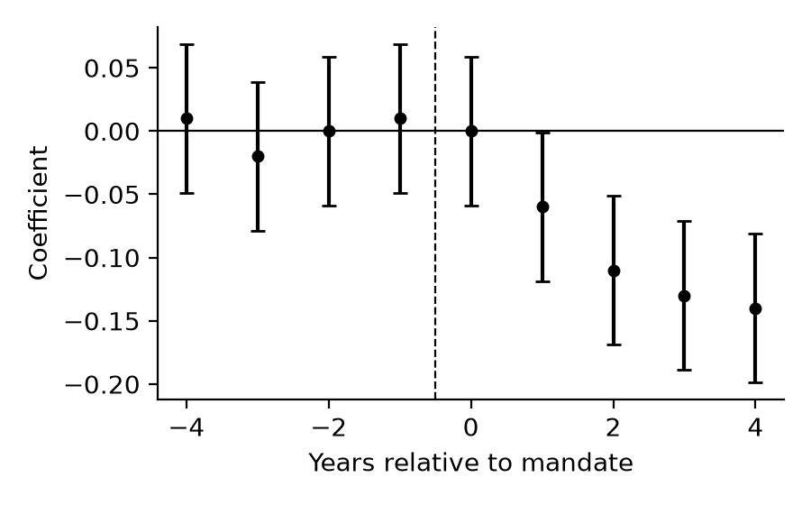

# Introduction

The classical model of deterrence conditions on the product of the sanction and
the probability of detection [@becker1968]. When detection is vanishingly rare,
that product goes to zero and the model predicts no deterrence at all. Yet a
large empirical literature reports behavioral responses to disclosure mandates
whose enforcement is essentially nominal [@shavell1984; @polinsky2000].

This paper takes that tension seriously. Following @becker1968 and the
refinement in @polinsky2000, we distinguish two channels through which
disclosure can bite even absent enforcement. @Tbl:main reports our
principal estimates.[^design]

[^design]: The staggered rollout is not randomly assigned, so we report
    event-study coefficients alongside the two-way fixed-effects estimate and
    show that pre-trends are flat. This is a substantive caveat, not a
    bibliographic aside — JLE forbids the latter in a footnote.

## Related Literature

Our contribution is closest to work on reputational sanctions
[see, for example, @shavell1984; @polinsky2000].

## Contribution

We add a channel decomposition that prior work leaves implicit.

# The Model

Let $\pi$ denote the probability of detection and $s$ the statutory sanction. A
risk-neutral firm commits the violation when its private benefit $b$ exceeds
the expected cost:

$$ b > \pi s + \rho D $$ {#eq:threshold}

where $D$ is the reputational loss triggered by disclosure and $\rho$ is the
probability that a disclosed violation reaches an audience that can impose it.
@Eq:threshold makes the identification problem plain: $\pi s$ and
$\rho D$ enter symmetrically.

## Comparative Statics

Differentiating with respect to $\rho$ gives $\partial b^{*} / \partial \rho = D > 0$.

# Data and Empirical Strategy

We combine violation records with ownership data.

# Results

Table: Effect of disclosure mandates on reportable violations {#tbl:main}

| Specification    | Violations | Std. error | Firms  | $R^2$ |
|------------------|-----------:|-----------:|-------:|------:|
| OLS              |     -0.061 |      0.028 | 12,411 | 0.212 |
| Firm FE          |     -0.118 |      0.031 | 12,411 | 0.487 |
| Firm + year FE   |     -0.142 |      0.034 | 12,411 | 0.503 |
| Dispersed owners |     -0.219 |      0.052 |  4,908 | 0.511 |

::: {custom-style="Table Note"}
Note. — The dependent variable is the log of one plus reportable violations.
Standard errors are clustered by state. + *P* < .10; \* *P* < .05; \*\* *P* < .01.
:::

The point estimate in the saturated specification implies a 14 percent
reduction, consistent with the reputational channel of @eq:threshold. In *International Salt Co. v. United States* (332 U.S. 392
[1947]) the Court took a comparably structural view of inferred effects.

{#fig:event width=4.5in}

@Fig:event shows no differential pre-trend.

# Conclusion

Disclosure deters even where enforcement does not, and the mechanism is
reputational.

# Appendix A. Robustness

All results are unchanged when we drop the two largest states.
